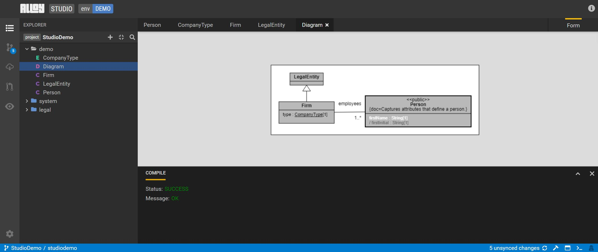

# Create a Diagram

Diagrams are visual representations of your models. Create a model diagram to show relationships across business concepts.

1. Click the **+** on the left-hand side and select **Add a new diagram**.
2. From the explorer view, select and drag the **Firm** and **Person** classes one at a time to the diagram.  

    

Share this diagram to share data and its relationships.

## Next steps

- [Edit a model](edit-model.md)
- [Create a model-to-model mapping](create-model-to-model-mapping.md)
- [Language](legend-language.md)
