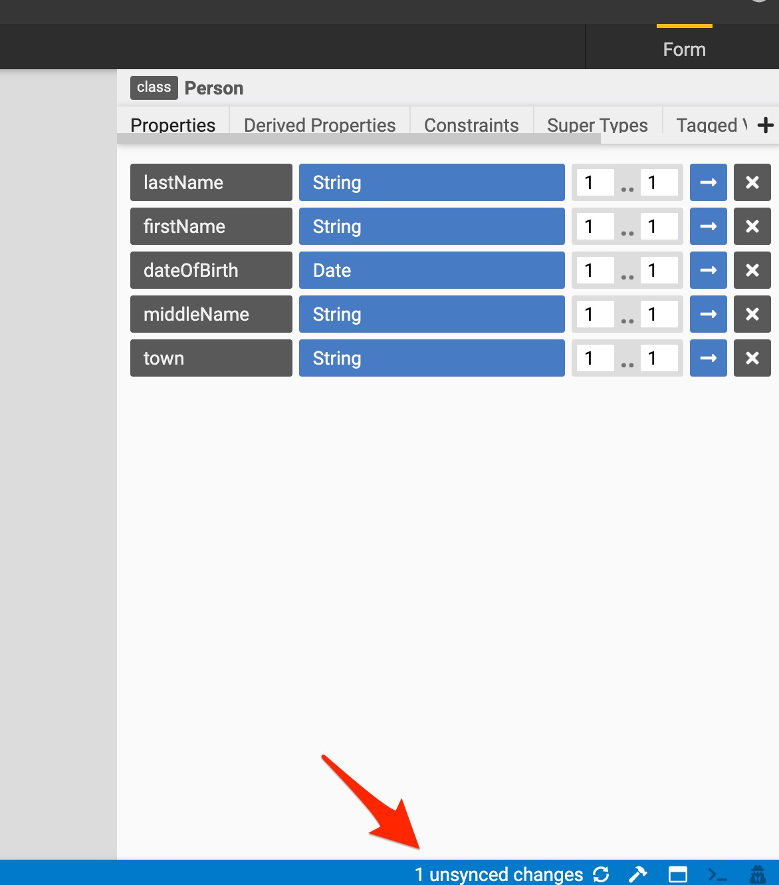
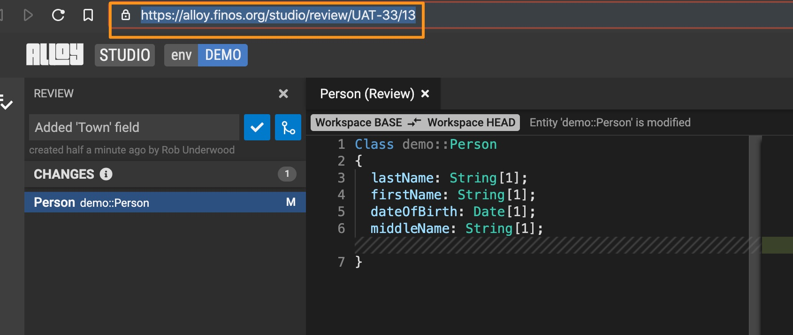
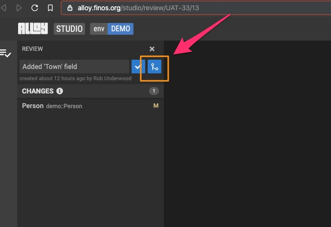

# Review process

The following are the steps the Modeler, Approver, and Merger take to submit, review, and merge a new change to a model within Legend.

## Modeler

1. Modeler submits a change.

    When a Modeler makes model changes in Legend, Legend keeps track of the changes made locally (known as unsynced changes). These changes need to be synced to the SDLC server in order for the Modeler to subsequently submit them for approval.

    

2. Modeler syncs their local changes to the SDLC server.

    To submit changes that a Modeler wants to merge, the Modeler needs to [sync](review-and-commit-changes.md) their local changes to the SDLC server. A Modeler can do this by pressing the sync icon in the status bar or by pressing `Ctrl+S`.

    

    **Note:** In GitLab, these changes are created as commits. The changes themselves are actually changes to the underlying model code as represented in JSON.

    

3. Modeler reviews changes, creates a review, and shares review.

    1. Review the pending change (the commit) using the Review tool.

        

    2. Create a review by giving it a name and clicking the **+** icon.

        

        A small diagonal arrow icon appears:

        

    3. Press the arrow to open the newly created review in a new tab where the URL of the review can be copied.

        

    4. Paste the URL into an email the Modeler might send to the working group requesting one or more participants in the working group to review and add their approval (their "+1" in support of merging).

## Approver

1. Approver reviews and approves the change.

    Once a review has been created and shared, others in the working group can review a proposed change and add their approval by clicking the checkmark icon.

    

    **Note:** In GitLab, the commit is shown as awaiting approval. Approvals can be done there alternatively, but it's recommended that Modelers use the Legend UI. The merge button is grayed out as sufficient approvals haven't been reached.

    

## Merger

1. Merger merges an approved change.

    Once enough approvals have been received based on the policy of the working group, the Merger can codify the change by merging it in (committing the review).

    

2. (Optional) Merge in GitLab.

    Alternatively, the Merger can do the merge directly in GitLab.

    

3. Use the CLA Bot check.

    GitLab and Legend are configured to make use of the FINOS Open Developer Platform's CLA Bot. The CLA Bot checks that the Modeler who submitted the change is covered under a Contributor License Agreement (CLA) authorizing them to make code contributions (like models) into FINOS.

    

4. Once you're done, make sure the Modeler updates their workspaces/branches.

    After new changes are merged into the master branch of a project, Modelers can pull the latest changes into the their current Legend workspace/branch. The blue dot on the cloud icon indicates that there are changes available to be pulled. Modelers will also see this icon and need to pull down changes whenever models are updated from an external source (like the ISDA CDM master).

    

## Next steps

- [Sync changes beyond Legend](sync-changes-beyond-legend.md)
- [Contribute to models](contribute-to-models.md)
- [Contribute code](contribute-code.md)
