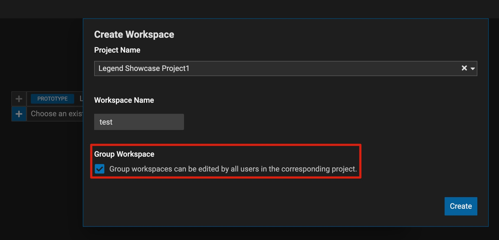
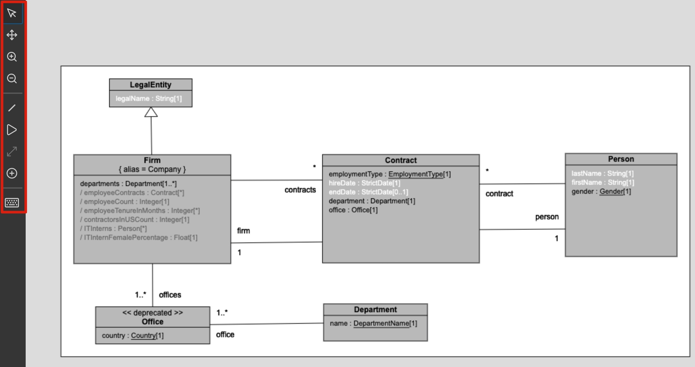
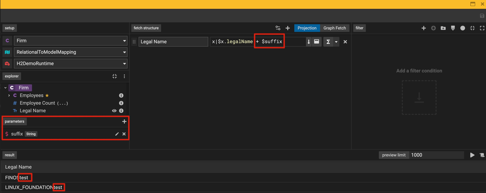
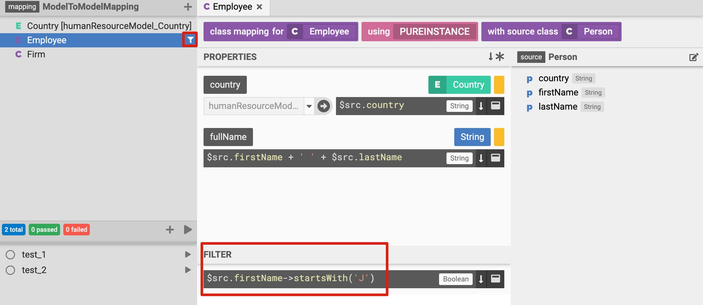
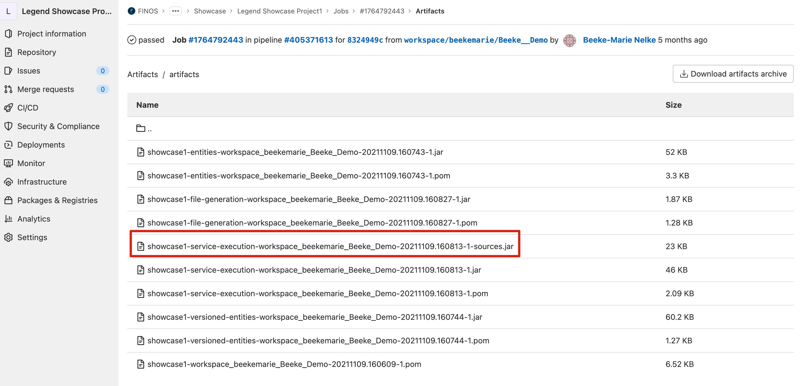
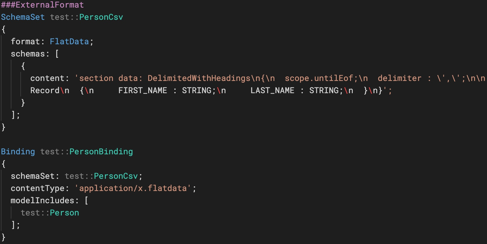

## Released Features

### Landing Page

**Share workspaces with other users via group workspaces.** No need to merge changes in your workspace to master anymore to make them visible to others. This adds additional functionality to Studio for easier collaboration in community driven projects.

### Diagram Editor

**Build data models entirely from the Diagram view**. This includes creating classes, adding attributes and defining data relationships. This unlocks a more intuitive and collaborative way to create data models. Find out more [here](https://legend.finos.org/docs/studio/create-diagram)

### Query Builder

**Convert query attributes to Derivations.** This allows users to further define the expected results of a query by enabling to write functions.

**Define parameters as part of your query.** This allows users to make use of advanced query functionality to improve the quality of the data received.

**Perform Calculations on your Query.** The Query Editor now supports performing aggregation functions as part of your query.

**See your query in text mode (PURE).** Users can review and edit their created queries using the user-friendly UI mode also in text mode.

### Mapping Editor

**Add a filter to model-to-model mappings.** This allows users to further restrict the values they would like to retrieve as part of the defined transformation.

### Service Editor

**Consume data models via service-execution JAR files generated as part of the GitLab pipeline.** Users can define data services on top of their relational-to-model mappings and systematically query modeled data when deploying the JAR files in their Java applications. Find out more [here](https://legend.finos.org/docs/studio/consume-service)

### External Formats

**Map a csv data source to a data model (beta).** Mapped csv data sourced can then be consumed via the generated service-execution JARs.

