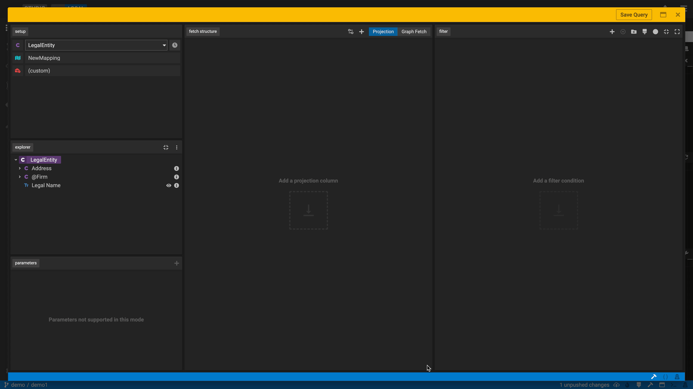

## Released Features
### Landing Page

**New Landing Page Look & Feel.** Start creating projects, viewing projects and setting up workspaces with ease in our new landing page. You'll be able to easily start viewing a project with the `view` button or editing a project with the `Edit Project` button. If you need help along the way, you can click on the `?` icon to view documentation on how to get started. More details [here](https://github.com/finos/legend-studio/pull/899).

### Query Builder

**Uplifted Look & Feel of the Query Builder.** It is now even easier to create ad hoc queries on top of modelled data and promote these to data services (APIs) via the uplifted Query Editor interface.

**Query a Milestoned Class.** Users can now query against a milestones class, which is a class that has a `temporal` stereotype defined. This allows users to include date parameters as part of their query, to ensure only values of a specific date are returned to them. More details [here](https://github.com/finos/legend-studio/pull/679).

**Leverage Tagging Mechanisms to streamline query usage across systems.** Users can tag a query so it can be referenced from another system or even use it to expose an API to search for queries with similar tag names. More details [here](https://github.com/finos/legend-studio/issues/633).

**Drag and drop of parameters in derived property editor.** Allows users to select listed available parameters for derived properties with parameter specifications. More details [here](https://github.com/finos/legend-studio/pull/766).

**Date Filter and Operations.** Dragging and dropping properties into the filter panel just got better! Users can now leverage a suite of support that are now displayed including >, >=, <, <=, is in, and is not in. More details [here](https://github.com/finos/legend-studio/pull/784).

**Leverage Subtype in Query Builder.** Users can navigate properties of subtypes in the explorer tree. These properties can be used in building queries through projection, graph fetch and filter features in form mode. More details [here](https://github.com/finos/legend-studio/issues/630).

**New Execute button.** Having trouble finding the execute button in the Query Builder today? Search no more, we've highlighted the button in blue for easy access!

**Adding Post Filter functionality in Query Builder.** Post filter ability is super helpful for several TDS functionality use cases. This new feature allows users to drag and drop simple columns, aggregated columns, derived columns and more into the post filter area. More details [here](https://github.com/finos/legend-studio/pull/902).

**New Function Explorer Panel.** Now you can access user-defined functions directly in the Query Builder via a function explorer panel. You can choose to show or hide the panel as needed and drag and drop your defined functions directly in the fetch structure panel. Additionally, you can hover over the `i` icon to view function details and also use the three vertical dots icon to view dependency project functions. More details [here](https://github.com/finos/legend-studio/issues/819).

**Export Query Results to csv file.** Check out the new export button we have in Studio's Query Builder! It allows you to download and save query results to csv where you can do further formatting, customization and analysis of your data. More details [here](https://github.com/finos/legend-studio/pull/836).

### Change Management (SDLC)

**Update out-of-sync workspaces with new Conflict Resolution feature.** This new conflict resolution feature checks for the latest version of the workspace and lets you easily update it. The workspace conflict resolution editor will highlight where conflicts arise so that when others make changes, you'll be able to see their changes, resolve any conflicts and get back in sync. More details [here](https://github.com/finos/legend-studio/pull/749).

**Share and upload recent unsaved local changes via a Patch.** This feature allows users to save (or write) a patch that they can then upload and apply to their local workspace. More details [here](https://github.com/finos/legend-studio/pull/748).

### UX/UI

**Name field selected when creating an element.** Previously, it took two clicks to begin naming a class or package you created in Studio. Now, we've uplifted the UX so it only takes one click to start editing! We default the cursor directly into the naming field so you can start naming your element (e.g. a class) as soon as you select it. 

**Click Studio icon to navigate back to the home screen.** Now, by clicking the Studio logo, you can navigate from the Studio Editor screen back to the home page anytime.
### Project View

**Viewer Mode Enhancements.** Now, the Studio Project View has a new edit functionality in the read-only mode. With these new features, users can update several details about their workspaces and review project builds. More details [here](https://github.com/finos/legend-studio/pull/778).

### GitHub Links

Please check out these links to get a full set of issues part of this release.

- [Studio Version 4.0.0](https://github.com/finos/legend-studio/milestone/14?closed=1)
- [Studio Version 3.0.0](https://github.com/finos/legend-studio/milestone/13?closed=1)
- [Studio Version 2.0.0](https://github.com/finos/legend-studio/milestone/9?closed=1)
- [Studio Version 1.0.0](https://github.com/finos/legend-studio/milestone/8?closed=1)
