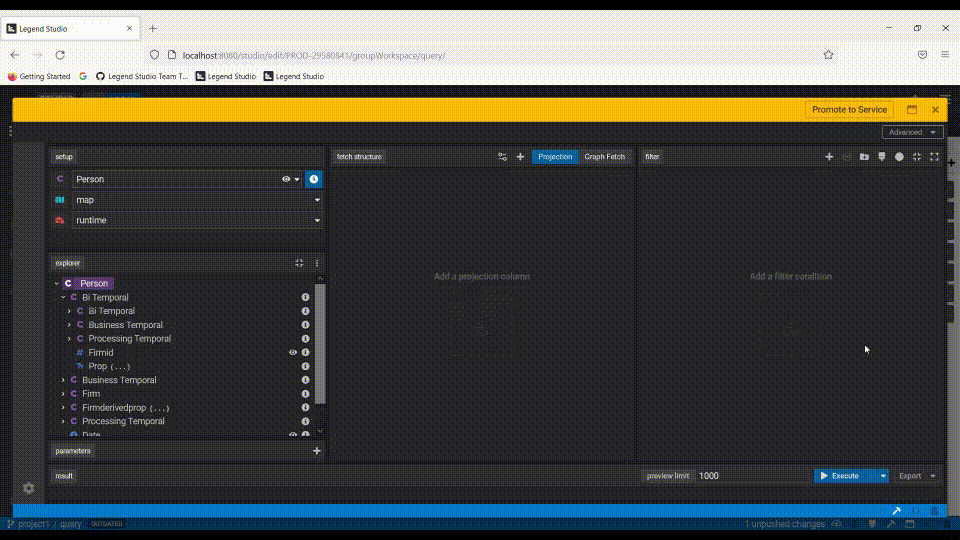
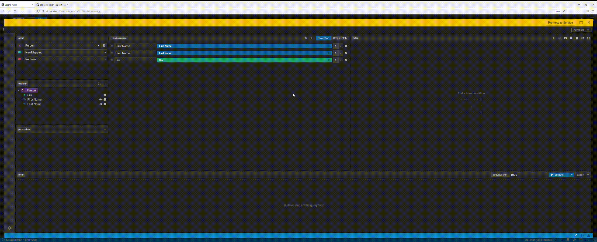
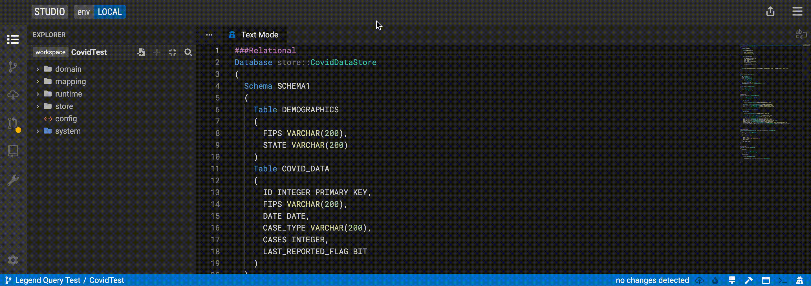
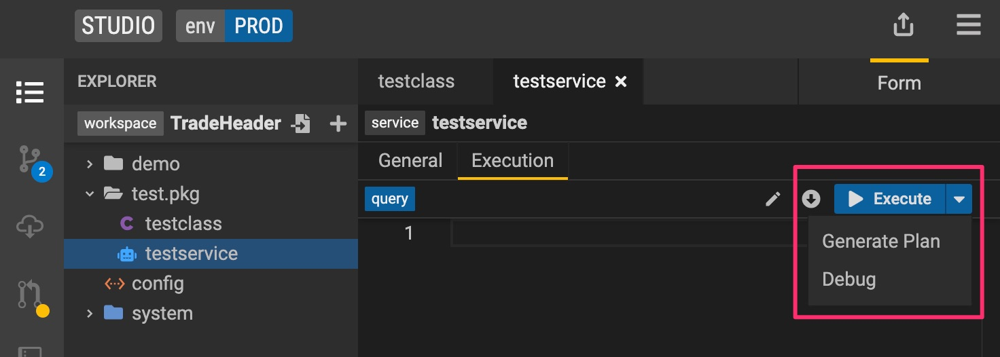
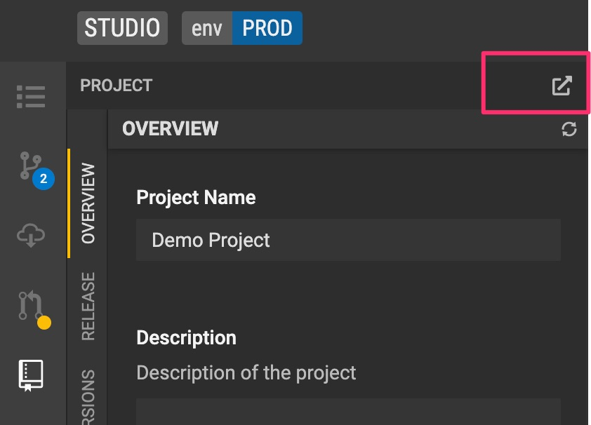

## Released Features

### Query Builder

**New date & time capabilities.** Query Builder now supports filtering by additional date and time values. These include `now()`, `today ()`, and customized absolute date & time values. Additional, date and time values can be used for filters, post filters, parameters and derived properties.  

**Date Propagations for milestoned properties.** Date propagations for milestoned properties are now supported. You can also overwrite default date parameter values for milestoned properties directly from the projection and filter panels. Previously, you would have to go to text mode to edit these.

**Aggregations for Enumeration values.** You can now perform aggregation operations in the projection column on an enumeration value when creating your query in the Query Builder. 

### Developer Experience

**Helpful documentation in text mode.** Another highly anticipated feature! This includes suggestions and auto-complete functionality to easier construct your data model code in Studio's text mode ("developer mode"). Users will also see help text with regards to data model code blocks (e.g. ### Mapping) when hovering over the keywords.

**Debug query execution with Plan Viewer.** Problems figuring out what is wrong with your query execution? Legend Studio's Execution Plan Viewer comes to the rescue! Check out the new debug log to find out what step the execution failed and prevented your query from running properly.

See more details [here](https://github.com/finos/legend-studio/issues/940).

**Launch GitLab project from Studio.** You can now navigate to the underlying GitLab project from Studio's "Project" view. Quick reminder, GitLab manages the data model SDLC under the hood and this is where your data model's code lives.

