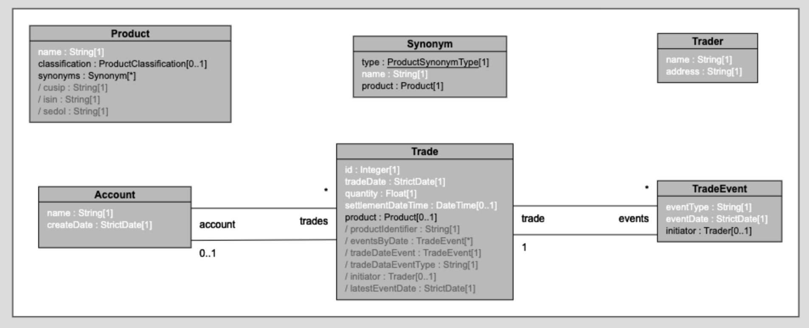
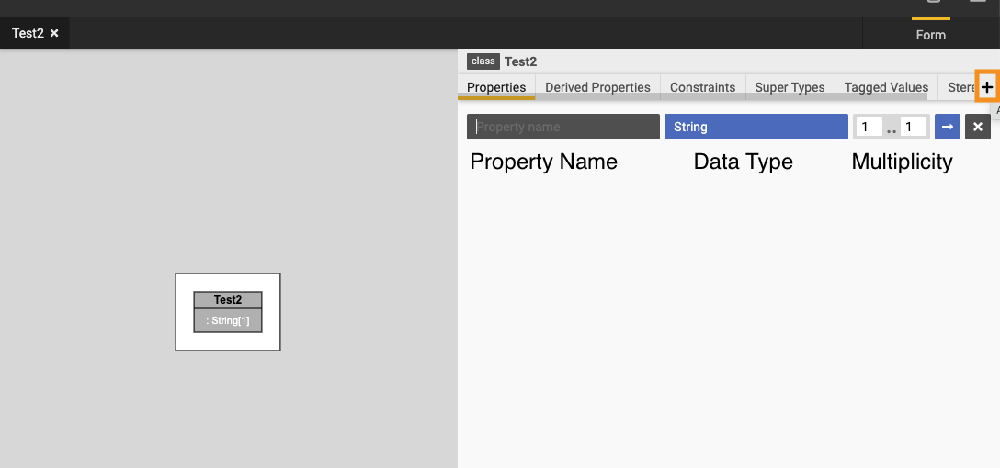
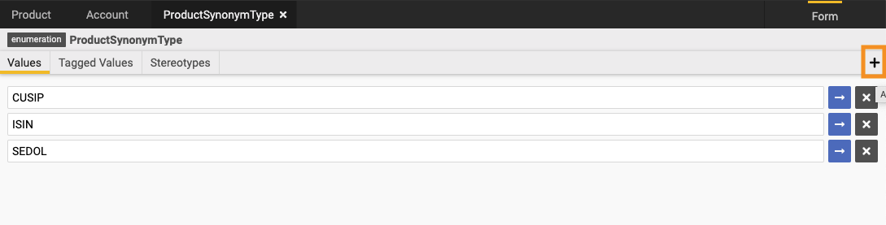
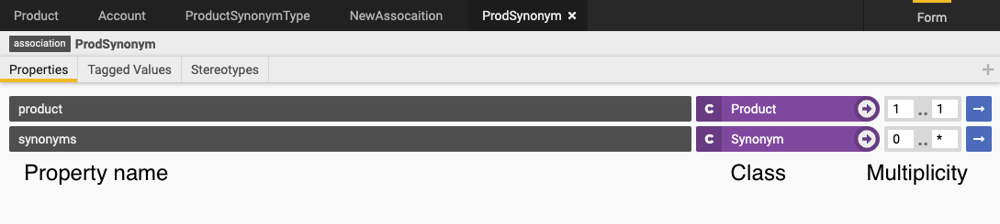
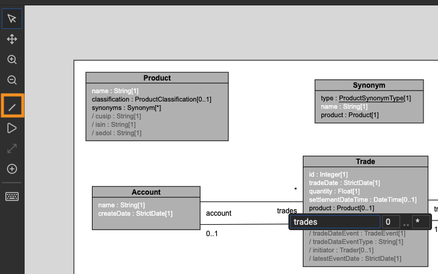

# ShowCase Project : Logical Modelling Basic 

This showcase project shows a basic Product-Account-Trade model.
https://legend-acct.finos.org/studio/view/UAT-40953672

In this showcase, we will show the following:
* [Create a new Doc](#create-a-new-doc)
* [Create a new Diagram](#create-a-new-diagram)
* [Create a new Class, define properties and multiplicity](#create-a-new-class)
* [Create a new Enumeration](#create-a-new-enumeration)
* [Define an association](#define-an-association)
* [Defining relationships in diagram](#define-relationship-in-diagram)

<a name="create-a-new-doc"/>

# Create a new Doc

A doc is creating by adding a new Text element.
To add a new Text element, Click on + and then select New Text. 
Provide a meaningful name to your text and then choose it to be either PlainText or a Markdown.  

In our Showcase, README is a text element.

<a name="create-a-new-diagram"/>

# Create a new Diagram

A diagram is like a canvas where we can add other elements. A Diagram helps you to define your classes and relationship between them.
It is a very convenient way to pictorially display your model.  

To add a new Diagram, Click on + and then select New Diagram.
Provide a meaningful name to your diagram and start adding new elements to the diagram.   

In our showcase, TradeAccountDiagram is the diagram which shows the model.

.

<a name="create-a-new-class"/>

# Create a new Class

There are two ways to create a class.  
1) Click on + and then select new Class, Provide a meaningful name
2) Open your diagram and double click in any free area in the diagram. Provide a meaningful name to your class

Class properties define attributes of a business concept. 
To add class properties, open the class and click on + button as shown in the image below.
Define the property Name, it's type and Multiplicity.

- The data type can be both primitives (like String or integers) or other Classes. 
- Multiplicity defines the number of instances that property can have within the class.
- There are other concepts like derived Properties, Constraints which will be covered in the next Showcase for advanced modelling.  

In our showcase, Account, Product, Trade etc all these are classes. Take some time to look at their properties, multiplicity etc.

.

<a name="create-a-new-enumeration"/>

# Create a new Enumeration

A Enumeration is a set of pre-defined values. It has a concept similar to enums in programming languages.  

To add a new Enumeration, Click on + and then select New Enumeration. Provide a meaningful name to your Enumeration.
To add values in your enumeration, open the enumeration and click on + as shown in the image below.
Define the values you need, and then you should be able to use these values as predefined values in your model.  

In our showcase, ProductSynonymType is an enumeration. 

.

<a name="define-an-association"/>

# Define an Association

Associations are used to define a single linking relationship between two classes. 
We can define one to one, one to many, many to many kind of relationships using association.  

To define an association, Click on + and select new Association. Provide a meaningful name to your Association.
Define the property name, select the class and multiplicy as shown below.

In our showcase ProdSynonym is an Association. Note that it shows that 1 product can have many synonyms. 

.

<a name="define-relationship-in-diagram"/>

# Define relationship in diagram

Relationships between classes can also be defined in the diagram. 
This is done by selection the Property tool in the diagram.
Select the property tool and drag a line between the classes you want to define a relationship.
Provide a name for the property and multiplicity for that relationship.  

In the image below it shows one account can have many trades attached to it.

.

### Join us

Join us at https://github.com/finos/legend