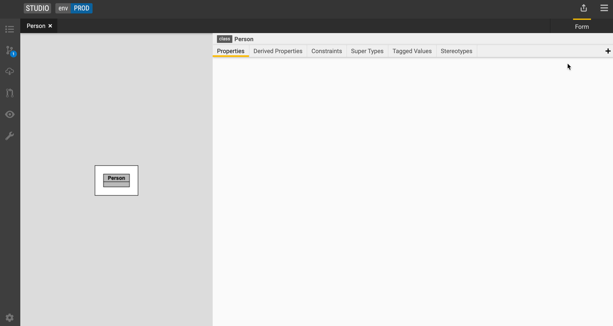

## Add a property (primitive data type)

Use properties in a class to define attributes of the business concept.

1. Go to the **Properties** tab and click the **+** icon.
2. Type in the name of your property and specify the [data type](../language/legend-language.md#primitive-types) and [cardinality](../language/legend-language.md#class).

    Let's create a property called `firstName` of type `String` with [cardinality](../language/legend-language.md#class) of 1.  

## Next steps

- [Execute a model-to-model mapping](execute-model-to-model-mapping.md)
- [Review and commit changes](review-and-commit-changes.md)
- [Language](../language/legend-language.md)
