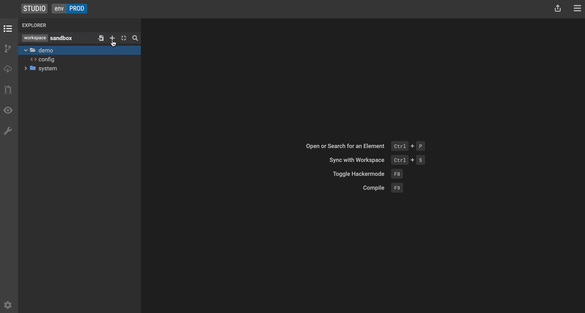

Use data models to describe your data and data relationships.

## Define a new model package

Create a package to start defining model hierarchies to group models into logical concepts.

1. Click the **+** icon next to **project**.
2. Click **Add a new package** to start a model hierarchy.

## Define a new class

Use classes to define a business concept.

1. Click the **+** icon.
2. Click **Add a new Class**.

    Let's create a class called `Person`.

    Studio displays a visualization of the class and a tabbed list of the possible model enrichments.

# Add a property (primitive data type)

Use properties in a class to define attributes of the business concept.

1. Go to the **Properties** tab and click the **+** icon.
2. Type in the name of your property and specify the [data type](../language/legend-language.md#primitive-types) and [cardinality](../language/legend-language.md#class).

    Let's create a property called `firstName` of type `String` with [cardinality](../language/legend-language.md#class) of 1.  

## Add a derived property

Derived properties are properties defined using functions that can operate on other attributes in the data model.

1. Go to the **Derived Properties** tab and click the **+** icon.
2. Type in the name of your property and specify the [data type](../language/legend-language.md#primitive-types) and [cardinality](../language/legend-language.md#class).
3. Type in the expression.

    Let's add a derived property called `employeeCount` using the following expression: `$this.employees->count()`.

4. Select a return [data type](../language/legend-language.md#primitive-types) of `Integer` and [cardinality](../language/legend-language.md#class) of 1.
5. Press **F9** to compile the expression.

# Add a constraint

Use constraints to define a validation or condition on the model that's expected to be met. The return type for a constraint is **Boolean**.  

1. Go to the **Constraints** tab and click the **+** icon.
2. Type in a name for the constraint and the expression.  

    Let's add a constraint called `nameNotEmpty` using the following expression: `$this.name->isNotEmpty()`.

3. Press **F9** to compile the expression.

## Create a Profile

Capture additional information (metadata) about the data model by creating a Profile. Profiles store and manage tagged values and stereotypes.

1. Click the **+** icon.

2. Click **New Profile**.
### Create a tagged value

Use tagged values to add context to your data model. For example, we can add the tagged value `alias` to our `Firm` class to make it easier for others to navigate our data model.

1. In the Profile editor, go to the **Tags** tab and click the **+** icon.

2. Type in `alias`.

### Add a tagged value to a class

1. Select the `Firm` class

2. Go to the **Tagged Values** tab

3. Drag and drop the **Profile** element into the Tagged Value tab OR hit the **+** icon.

4. Select `alias`.

5. Type in `Organization`.

The `Firm` class now shows the additional context.

### Create a stereotype

Use stereotypes to extend metadata information about a model. For example, you can annotate your model with labels like *legacy* or *deprecated*.

1. In the Profile editor, go to the **Stereotypes** tab and click the **+** icon.

2. Type in `deprecated`.

### Add a stereotype to a class

1. Select the `Firm` class

2. Go to the **Stereoptypes** tab

3. Drag and drop the **Profile** element into the Stereotypes tab OR hit the **+** icon.

4. Select `deprecated`.

The `Firm` class now shows the additional metadata information.

## Create and add an enumeration

A model attribute that has a finite list of values can be defined with an enumeration.

1. Click the **+** icon on the left-hand side and select **Add an enumeration**.
2. Select the values for the enumeration.

    Let's create an enumeration called **CompanyType** with the values **LLC** and **Corporation**.

    

3. Create a new class called **Firm** with a property named **type**.
4. Select **CompanyType** for the property type and a [cardinality](../language/legend-language.md#class) of 1.

    

## Add a super type

Add a Super Type to the model to show a relationship between classes or business concepts.

Let's create a new class called **LegalEntity**.  

1. Moving back to the **Firm** class, go to the **Super Types** tab and click the **+** icon.
2. Select the **LegalEntity** class from the dropdown.

    The model visualization on the left now shows the **LegalEntity** class as a super type of **Firm**.

    

## Add a property (non-primitive data type)

Create a relationship between the **Person** and **Firm** classes.

1. In the **Firm** class, create a property with the following values:
    - Name: **employees**
    - Type: **Person**
    - Cardinality: **1..**
