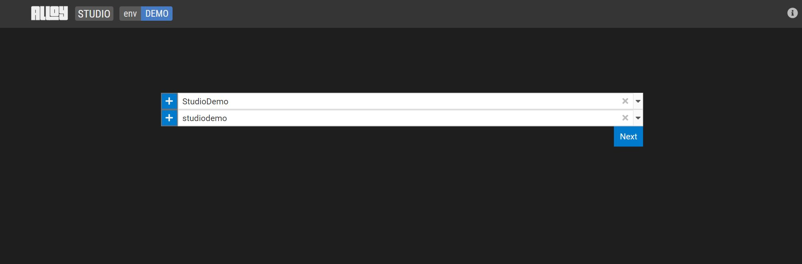

Start working on your data model by creating a workspace. Workspaces let users collaborate on the same project. A Workspace is a copy of a project which can be later merged back into the main project. To create a workspace:

1. Select an existing GitLab project or select **+** to start working on a new one.  

    

2. Create (or choose) a workspace.

    

3. Click **Next.**

## Next steps

- [Create a model](create-model.md)
- [Create a diagram](create-diagram.md)
- [Edit a model](edit-model.md)
