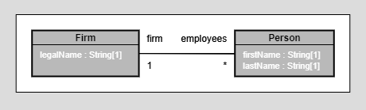
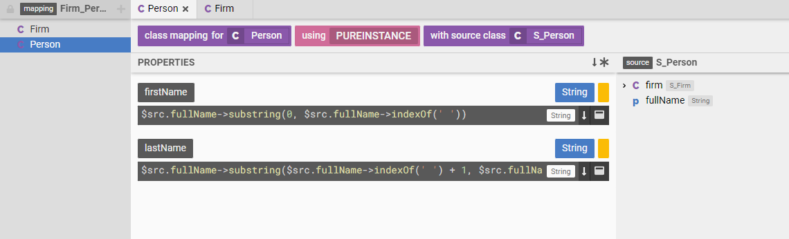
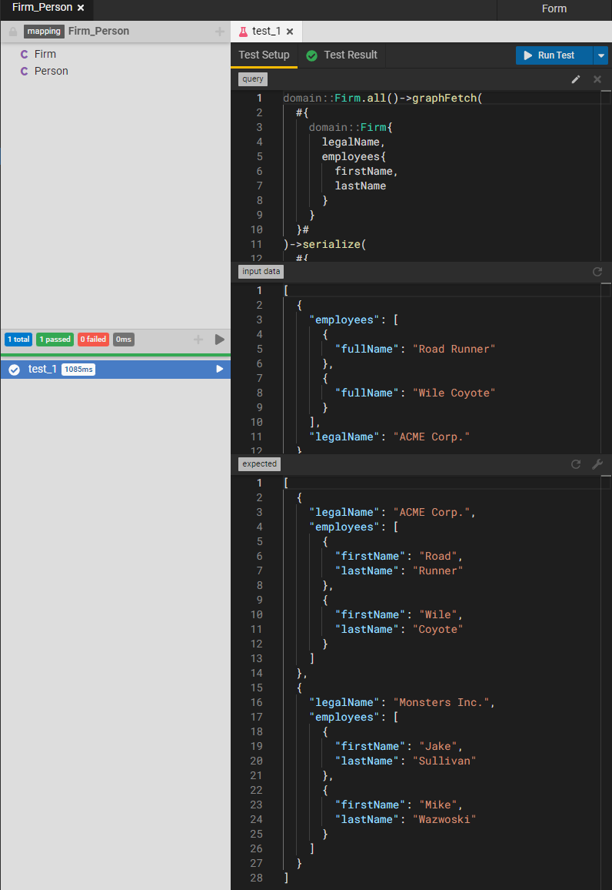
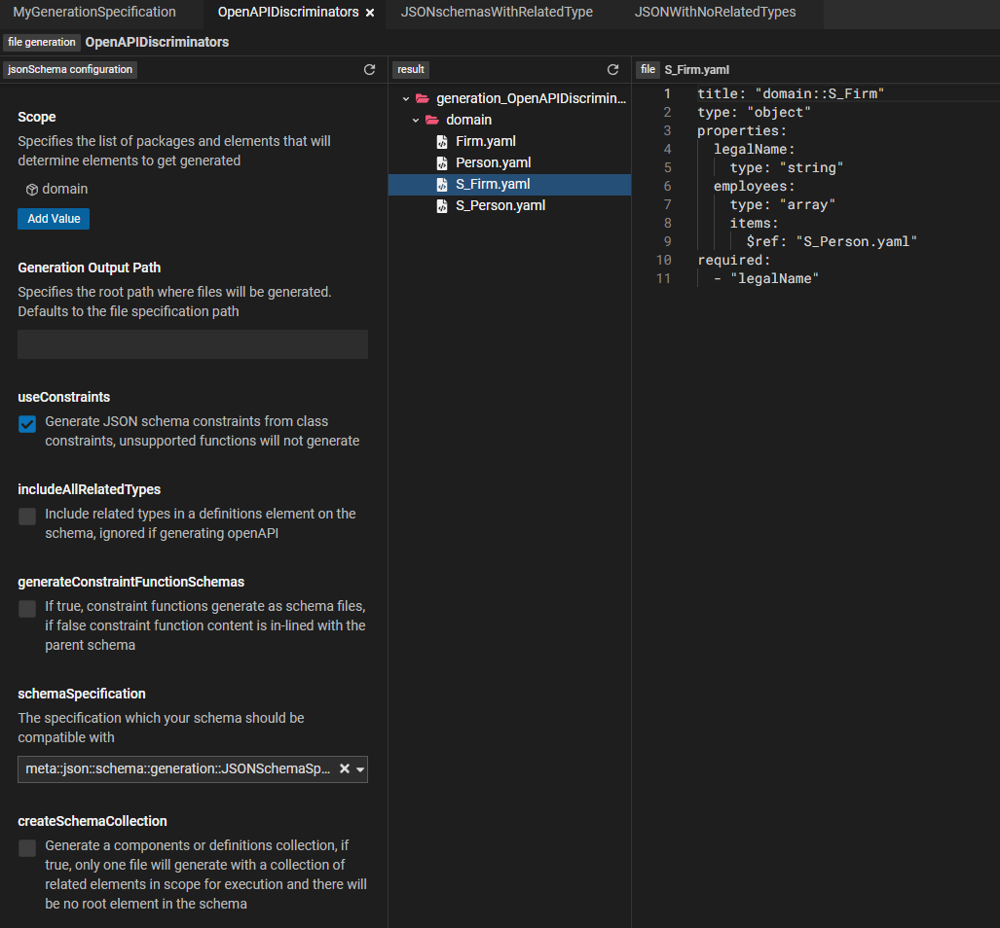

# A (mini) tour of Legend 

The Legend platform consists of many products, features and integrations. The goal of this tour is to provide a feel and flavor for what is possible with Legend.

* [Data models](#data-models)
* [Do we even need a data model ?](#why-models)
* [Communicating with models](#model-communication)
* [Transforming data with models](#model-transformation)
* [Testing with models](#model-testing) 
* [Managing model evolution](#model-evolution)
* [Executing with models](#model-execution)
* [Connecting to data(bases)](#connect-database)
* [Connecting to data(systems/APIs)](#connect-apis) 
* [Extracting value out of models](#model-extract-value)
* [And ... there's more](#theres-more)

<a name="data-models"/>

# Data models

Everything in Legend revolves around a data model. A Legend data model is a systematic way of describing business concepts and the relationships between them. 

One way to create a data model in Legend is to use Legend Studio. Studio is a browser based, rich modeling application that allows users to create and interact with data models. 

## Firm-Employee model

Let's say we are trying to model a Firm and its Employees 
* A Firm has a legal name.
* A Firm has many employees.
* An Employee has a first and last name. 

The above description, while simple is not complete. For e.g. how many employees can a firm have ? 

The Legend platform's Pure language provides a systematic way to describe this model as follows :

```
Class domain::Person
{
  firstName: String[1];
  lastName: String[1];
}

Class domain::Firm
{
  legalName: String[1];
}

Association domain::Firm_Person
{
  firm: domain::Firm[1];
  employees: domain::Person[*];
} 
```

You can see the full model in the ["Legend Showcase - Guided Tour" Studio project](https://legend.finos.org/studio/view/UAT-38029096/entity/domain::Firm)   

<a name="why-models"/>

# Do we even need a data model ?

This question deserves its own blog post/article. But in brief, a data model allows all participants in a data flow to have the same view of the data. This includes concepts, relationships, attributes etc.

This common understanding prevents/reduces data corruption/inconsistencies, allows teams to communicate more transparently and efficiently about data and increase efficiency of data management. 

To learn more about the benefits of data modeling, check out [Pierre DeBelen's keynote at the 2020 Open Source Strategy Forum](https://www.youtube.com/watch?v=93c966jNzYo).

<a name="model-communication"/>

# Communicating with models

A huge benefit of a model is that it allows teams to more efficiently communicate about data. 

One way to communicate about data is to draw a diagram of the data model. The beauty of a model centric approach is that this diagram need not be drawn by hand. The diagram below was ```generated``` from the logical model created in the 
previous step

.

You can navigate to the live diagram by following this link - https://legend.finos.org/studio/view/UAT-38029096/entity/diagram:all 

<a name="model-transformation"/>

# Transforming data with models

More often than not, data exists in a shape that is not ideal. In which case we have to transform the data from the shape it is currently in to the shape that we desire.  In Legend, we call this a "model to model mapping". 

We have a model of the shape the data should be in, the target model. We have a model of the shape the data is currently in, the source model. Now, all we need to do is define a set of rules that map between the source and target models.

.

Once these rules have been defined, Legend can automatically execute the mapping or data transformation.

You can navigate to the live mapping by following this link - https://legend.finos.org/studio/view/UAT-38029096/entity/mapping::m2m::Firm_Person

<a name="model-testing"/>

# Testing with models
In Legend, we treat models as software. 

Tests are crucial for building and maintaining software. As software changes over time, a good set of tests that capture functional requirements helps bugs and other regressions in behavior to be detected early in the development cycle.

In Legend, model elements are ```Testable```. As a concrete example, a model to model mapping is testable. This means that we can write tests for the model to model mapping by providing expected and actual values. 

.

<a name="model-evolution"/>

# Managing model evolution

Models change over time to accommodate new/changing business requirements. Legend not only provides best-in-class modelling capabilities, but also integrates with your source control system to provide source control for the data models.

Every Studio project is backed by a Gitlab project. Edits to the Studio project are flushed to the underlying Gitlab project. 

Studio also supports the notion of user and group workspaces. These are implemented as Git branches and are designed to allow the implementation of pull request/merge request style workflows. 

While Legend currently only supports Gitlab, support for other source control systems can be added. This allows organizations to implement a model evolution workflow that integrates seamlessly with their own internal change management, software management systems.

The Gitlab project for the "Legend Showcase - Guided Tour" project can be found here - https://gitlab.com/finosfoundation/legend/showcase/legend-showcase-project-guided-tour

<a name="model-execution"/>

# Executing with models

So far we have been executing models by running transformations etc. in the Studio application. 

A model to model mapping can be executed outside Studio by generating an executable artifact. One such artifact is a "service execution jar". A service execution jar is Java jar file that is generated from the Legend model.

A "service" is a Legend model element that provides the different components needed for an execution, which are :
* A query - This defines the query to be executed
* A mapping - This defines the model to model mapping rules to be applied  
* A connection - This defines the connections or data sources from where data should be sourced

Once all these of have been defined, Legend generates an execution plan. This execution plan and the code to execute the plan is then nicely packaged into a self-contained Java jar file. 

Continuing with our goal of integrating with user's change management systems, the pipeline to generate this Java jar is implemented as a Gitlab pipeline. The pipeline generates and publishes the Jar to a repository such as Maven Central or the Gitlab project's registry.

The Gitlab pipeline definition can be found here - https://gitlab.com/finosfoundation/legend/showcase/legend-showcase-project-guided-tour/-/tree/master

Execution is then just a question of downloading and executing this jar.

```
public ImmutableList<String> getAllFirmNamesViaM2M() throws Exception
    {
        ServiceRunner serviceRunner = ServiceRunnerBuilder
                .newInstance()
                .withServiceRunnerClass("org.finos.legend.showcase.guided_tour.service.m2m.service1")
                .build();
        ServiceRunnerInput serviceRunnerInput = ServiceRunnerInput
                .newInstance();
        String result = serviceRunner.run(serviceRunnerInput);
        return this.parse(result);
    }
```

An example Maven Java project that uses a service execution jar can be found here - https://github.com/finos/legend/tree/master/examples/service-execution-jar/legend-guided-tour-application

<a name="connect-databases"/>

# Connecting to data(bases)

Executing a query requires sourcing data from a "database". Legend supports a variety of relational databases where Legend converts a Pure query into a SQL query that is executed against the database. 

Querying data from a relational database requires a model to model mapping as well. Except in this case we map from a logical model to a physical (relational) model of the data. 

In other words the model allows users to say "My Firm class has a legal name attribute. Data for the Firm class is in the FIRM database table in a database at mydatabase.com".

.

You can navigate to the live mapping by following this link - https://legend.finos.org/studio/view/UAT-38029096/entity/mapping::relational::Firm_Person


Continuing with our test first approach, Legend supports "in-memory test databases". The Legend tests can define an in memory database along with test data.  During test execution, Legend spins up an in-memory database with the test data before executing the plan.

<a name="connect-apis"/>

# Connecting to data(systems/APIs)

Data does not exist only in relational databases. 

A cool feature of Legend is "Service Store Connections". In a service store connection, instead of mapping a logical model to relational model, we map the model to the data returned by an HTTP/S API.

<a name="model-extract-value"/>

# Extracting value out of models 

A model is a gift that keeps on giving. Also, the Legend platform is a gift that keeps on giving.

Legend and the model can be used to extract more and more value out of models. 

One way to extract value is to generate artifacts from the model. Here are a few examples of extracting value :
* Generating Java classes from the model 
* Generating OpenAPI specifications from the model 
* Integrating with other data platforms and systems

The image below shows OpenAPI specifications generated out of the model: 

.

<a name="theres-more"/>

# And ... there's more 

We have barely scratched the surface of Legend. Legend offers many products and features that can help streamline your data processing.

Here are a few suggestions to get started  :

### Explore showcase projects 

Explore the various Legend showcase projects for a deep dive into various platform features. https://github.com/finos/legend/wiki/Legend-Showcase 

### Explore Legend documentation 

The Legend documentation site has links to tutorials and other documentation. https://legend.finos.org/docs/overview/legend-overview

### Install Legend and take it for a spin 

The Legend documentation site has links to tutorials and other documentation. https://github.com/finos/legend/tree/master/installers 

### Join us

Join us at https://github.com/finos/legend 


