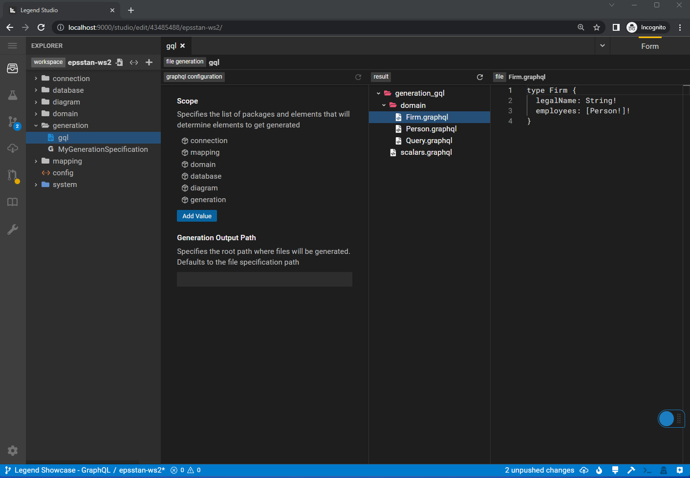

# GraphQL   

This tutorial demonstrates the uses of the GraphQL protocol in Legend. 

## Requirements 

* An installation of Legend with the following components :
    * Studio 
    * Engine 
    * Depot Store 
    * Depot 
    * GraphiQL client
  
* Legend Studio Project - https://gitlab.com/finosfoundation/legend/showcase/legend-graphql-showcase 

## Setup 

### 1. Install Legend

This showcase uses the Docker Compose installers documented [here](https://github.com/finos/legend/tree/master/installers/docker-compose).

The command below installs and starts Legend Studio, Query, Engine, Depot Store and Depot Store.

```
./docker-compose.sh --profile query up -d --force-recreate 
```

### 2. Index Studio Project

This tutorial uses Legend Depot to get the serialized Legend models (also called 'entities').

The command below adds the models of the 'Legend GraphQL Showcase' Studio project to the depot. 

```
curl -v -X GET "http://localhost:6201/depot-store/api/queue/PROD-4567/org.finos.legend.showcase/graphql/1.0.1?maxRetries=5" -H "accept: text/plain"
```

### 3. Start a GraphiQL client

The command below starts an Apache httpd server that serves a HTML page that implements a GraphiQL client.

```
./docker-compose.sh --profile graphiql up -d --force-recreate
Creating legend-httpd ... done
```

## Tutorial 

### GraphQL Primer 

In GraphQL, we start by defining an object type that is the basis for all query operations :

```
type Query {
  firmByLegalName(legalName: String!):Firm 
}
```

With this definition in place, we can query a GraphQL server that implements the above types, as follows :

```
query Query1 {
  firmByLegalName(legalName :"ACME Corp.") {
    employees {
      firstName
      lastName
    }
  }
}
```

### Legend GraphQL Queries

In Legend, we support GraphQL by bridging the GraphQL protocol to Legend's GraphFetch protocol. In other words, Legend consumes a GraphQL query, converts it into GraphFetch and then executes the GraphFetch protocol.

Just like we defined the root object type in GraphQL, we define a root Legend class that will be the basis of all query operations.

```
Class domain::Query
{
  firmByLegalName(legalName: String[1]) {domain::Firm.all()->filter(f|$f.legalName == $legalName)->first()}: domain::Firm[0..1];
}
```

With this class defined, we can start querying using GraphQL. 

To query, navigate to the GraphiQL client (http://localhost:9099/graphiql) and enter the following GraphQL query.

```
query Query1 {
  firmByLegalName(legalName :"ACME Corp.") {
		employees {
      firstName
      lastName
    }
  }
}
```
When the query is executed, you should see a response as follows :

```
{
  "data": {
    "firmByLegalName": {
      "employees": [
        {
          "firstName": "Road",
          "lastName": "Runner"
        },
        {
          "firstName": "Wile",
          "lastName": "Coyote"
        }
      ]
    }
  }
}
```

The HTML input element at the top of the GraphiQL client provides Legend with the metadata that it needs to execute the GraphQL/GraphFetch query.

```
http://localhost:6300/api/graphQL/v1/execution/execute/prod/org.finos.legend.showcase/graphql/1.0.1/query/domain::Query/mapping/mapping::relational::Firm_Person/runtime/connection::runtime::h2
```

In the example above, we are providing the following metadata to Legend 
* ```http://localhost:6300/api/graphQL/v1/execution/execute/prod/``` - The `prod` path indicates that model entities should be sourced from Legend Depot
* ```org.finos.legend.showcase/graphql/1.0.1``` - The Maven coordinates of the model entities 
* ```query/domain::Query``` - The Legend class that defines the GraphQL query root
* ```mapping/mapping::relational::Firm_Person``` - The Legend mapping to be used to execute the underlying GraphFetch query. 
* ```runtime/connection::runtime::h2``` - The Legend runtime to be used to execute the underlying GraphFetch query.

### GraphQL Schema Generation 
Legend is also able to generate GraphQL schemas from the Pure model. 

First, create a new package. 


Then, in the package, create a file generation.


Once the generation has been created, generated GraphQL schemas are shown. 



## Upcoming Features

The following features are not supported as yet but will be added soon. 
* Querying using input types 
* GraphQL schema generation for input types 

## Known bugs  
* Out of order field arguments - Arguments have to be specified in the same order as in the Pure Query class

## Reference 

Reference documentation on the design/implementation of the GraphQL integration can be found [here](https://github.com/finos/legend-engine/blob/master/docs/graphQL/graphQL.md)

## Code 

Legend Engine source code is in the Maven modules named ```legend-engine-xt-graphQL-XXXX```
