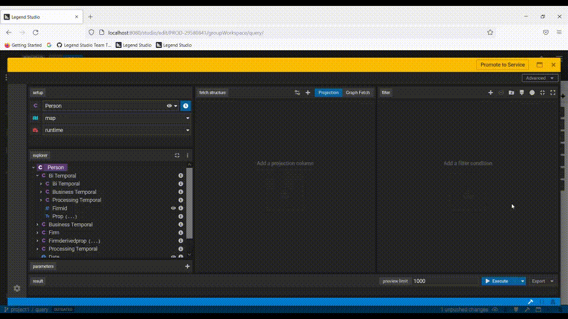
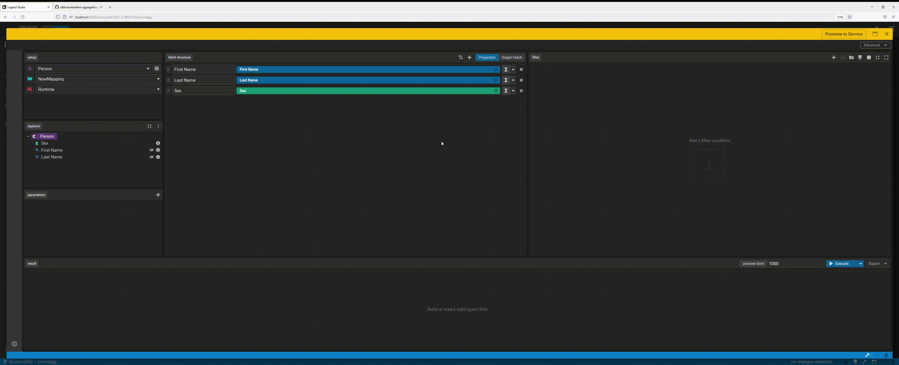

## Build a Query
You can build a query directly in Alloy Studio using its drag-and-drop environment, Query Builder. To create a query, right-click any class with mapped data and drag-and-drop the fields you want to the central panel. To execute the query, click `play`. 

### Convert query attributes to Derivations.
Further define the expected results of a query by writing functions.

### See your query in text mode (PURE).
Review and edit your created queries using the user-friendly UI mode also in text mode.

### Leverage Subtype in Query Builder.
Navigate properties of subtypes in the explorer tree. These properties can be used in building queries through projection, graph fetch and filter features in form mode. More details [here](https://github.com/finos/legend-studio/issues/630).

## Test Querying your Data model

_Coming soon._

## Core Features

### Class Explorer 

_Coming soon._

### Function Explorer

The function explorer shows you all the functions you have defined and lets you drag and drop to selected panels in the query builder including the derviation projection columns.  

### Parameters

Parameters are variables assigned to your query. They are dynamic in nature and can change for each execution.

### Constants

Constants are static values set to a variable name that can be leveraged within your query. They remain the same for ALL executions.

### Filter

#### Date Filter and Operations
Leverage <kbd>&gt;</kbd>, <kbd>&gt;=</kbd>, <kbd>&lt;</kbd>, <kbd>&lt;=</kbd>, <kbd>is in</kbd>, and <kbd>is not in</kbd>. More details [here](https://github.com/finos/legend-studio/pull/784).

### Milestoning

#### Date Propagations for milestoned properties
Query supports propagations for milestoned properties. You can also overwrite default date parameter values for milestoned properties directly from the projection and filter panels or from Text Mode.

### Watermark

You can add a watermark to your query through the advanced options tab. If a watermark is present, a waterdrop icon will appear on the top left of your query and you can also edit your watermark by clicking that icon. 

## Fetch Structure - Tabular Data Structure 

### Projection Columns

#### Aggregations for Enumeration values.

You can perform aggregation operations in the projection column on an enumeration value when creating your query in the Query Builder. 

### Post Filter

You may add a filter that will be applied to your Tabular Data Structure Columns that were defined through the projection panel by adding a post-filter.

### OLAP
OLAP lets you add [window](https://mode.com/sql-tutorial/sql-window-functions/) columns to your query. 
See: 

### Result Modifiers

_Coming soon._

## Fetch Structure - Graph Fetch 

_Coming soon._

## Open an Existing Query 

_Coming soon._

## Edit a Service Query

_Coming soon._

## Executing Queries

### Query Data as of Specific Dates and Times

Query Builder supports filtering by additional date and time values. These include <kbd>now()</kbd>, <kbd>today ()</kbd>, and customized absolute date & time values. Additional, date and time values can be used for filters, post filters, parameters and derived properties.  

### Apply operations, transformations, and calculations to your datasets in the Query Editor

The Query Editor supports performing aggregation functions as part of your query.

### Execute With Parameters

### Export Data

Once you are content with your data, you can also export to other types. For now we support exporting your query results to `CSV`.

## More
- [Showcase projects](../showcases/showcase-projects.md)
- [Legend Features](../overview/legend-features.md)
- [Legend Glossary](../overview/legend-glossary.md)
- [Reference documentation](../reference/legend-language.md)
- [Studio tutorials](../tutorials/studio-workspace.md)
- [Query tutorials](../tutorials/query-builder.md)
