## Query Builder
You can build a query directly in Alloy Studio using its drag-and-drop environment, Query Builder. To create a query, right-click any class with mapped data and drag-and-drop the fields you want to the central panel. To execute the query, click `play`. 

## Create a Query

_COMING SOON_

## Core Features

### Class Explorer 
_COMING SOON_

### Function Explorer
The function explorer shows you all the functions you have defined and lets you drag and drop to selected panels in the query builder including the derviation projection columns.  

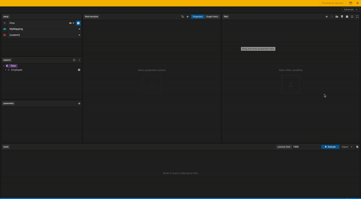

### Parameters 
Parameters are variables assigned to your query. They are dynamic in nature and can change for each execution.

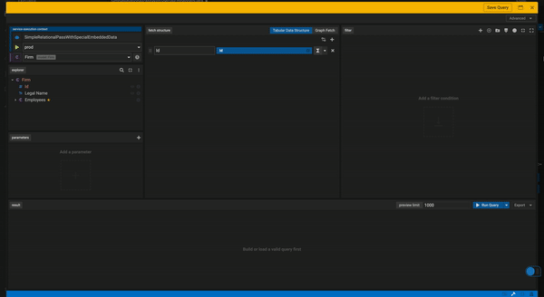

### Constants
Constants are static values set to a variable name that can be leveraged within your query. They remain the same for ALL executions.

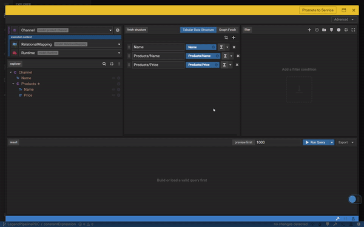

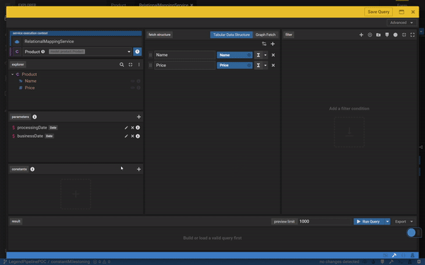

### Filter
_COMING SOON_

### Milestoning 

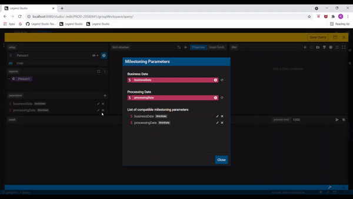
### Watermark

You can add a watermark to your query through the advanced options tab. If a watermark is present, a waterdrop icon will appear on the top left of your query and you can also edit your watermark by clicking that icon. 

## Fetch Structure - Tabular Data Structure 

### Projection Columns

_COMING SOON_

### Post Filter
You may add a filter that will be applied to your Tabular Data Structure Columns that were defined through the projection panel by adding a post-filter.

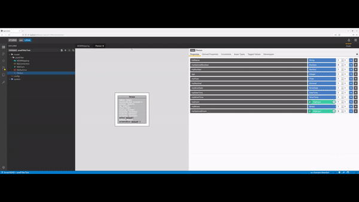

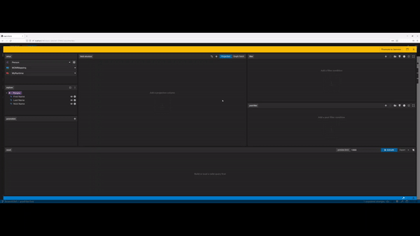

### OLAP
Olap let you add [window](https://mode.com/sql-tutorial/sql-window-functions/) columns to your query. 
See: 

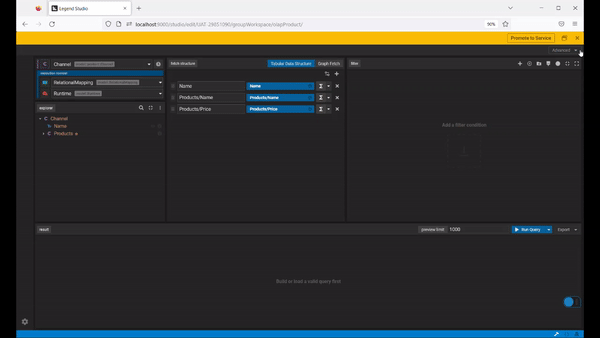

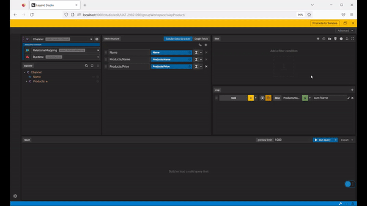

### Result Modifiers

_COMING SOON_

## Fetch Structure - Graph Fetch 

_COMING SOON_

## Executing Queries

### Execute With Parameters

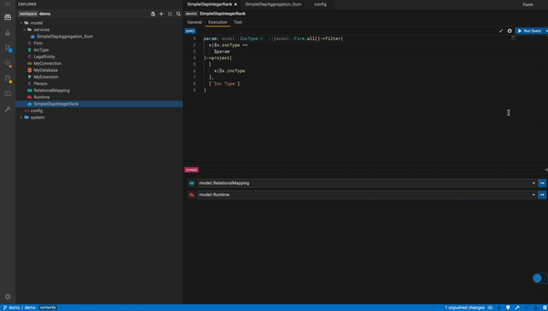

### Export Data

Once you are content with your data, you can also export to other types. For now we support exporting your query results to `CSV`.

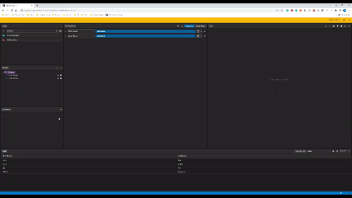

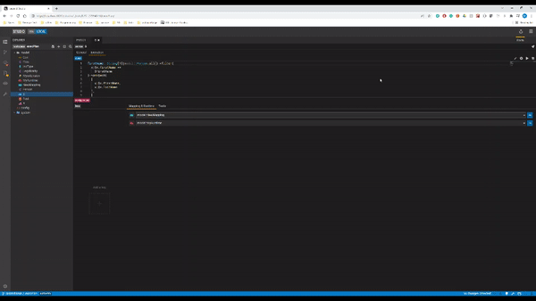
