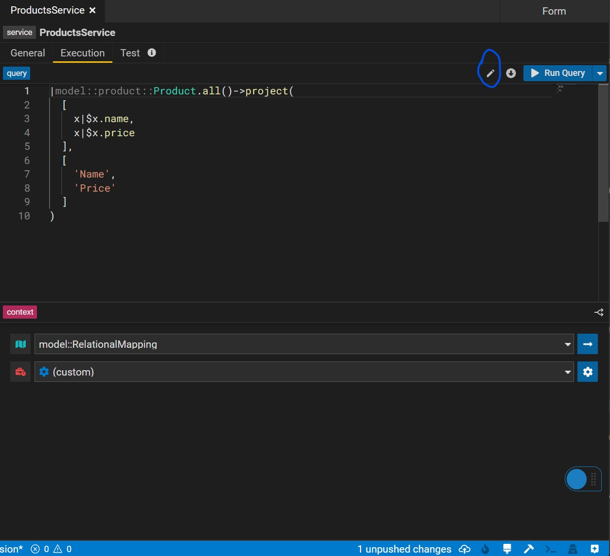
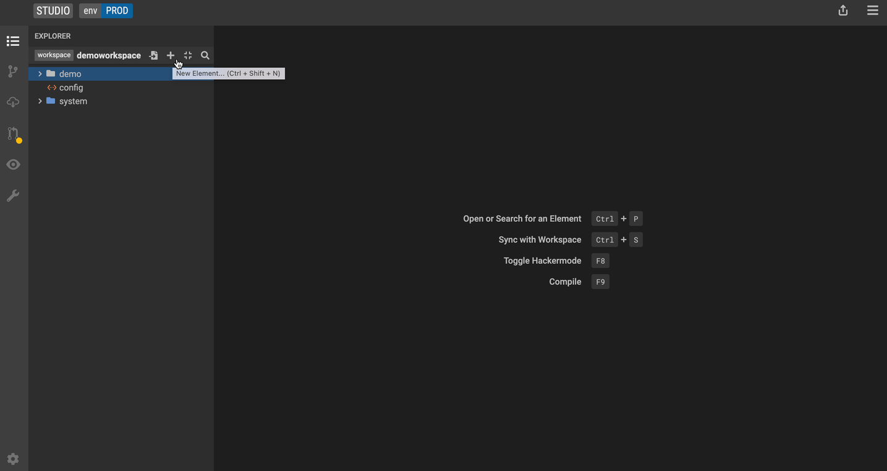

## Create a Service 

Build services on top of data queries to consume modeled data systematically. To create a service select <kbd>New Service</kbd> from the drop down menu to launch the [Service Editor](../concepts/legend-concepts.md/#service-editor)

### General Tab

In the <kbd>General</kbd> tab of the Service Editor, users can specify metadata of their service including the service URL, documentation and owners. URL parameters can be directly defined within the {} sytnax.

   

### Execution Tab

In the execution tab, users can create and edit their service query. By hitting the pencil icon button, users can edit the query using the [Query Builder](../concepts/legend-concepts.md/#query-builder). Users can make changes to the query either in the user-friendly form mode or in text mode. 

Additonally the bottom panel lets you define your execution context which represents the mapping and runtime used when executing your query.

**Multi** Executions lets you use a service parameter to decide what execution context (mapping, runtime) to use. You can switch between multi and single using the top right icon on the context panel. 

   

### Tests Tab

This panel lets you define tests for the services you write by specifying test data, serialization format of your test and the assertions. 

## See features in action

### Create a Service


### Create a multi execution service


## Create a Service Test 

### Create connection test data
Click the `generate` button to automatically generate test data if possible. Otherwise, manually create test data.

### Relational
Add relational data tables based on databases to which the service's mapping connects. 

It is unnecessary to provide all columns with test data. The columns used in the service, however, require test data. Besides, the primary keys have to be distinct.


### External Format (M2M)
Click the `generate` button to automatically generate test data if possible. Otherwise, manually provide test data for the source class' properties that serve as the foundation for the properties used in the service. e.g. As shown in the video, _Firm's name is used in the service, which comes from Firm's legalName. Therefore, manually providing test data for legalName will be sufficient if the `generate` button is not working.


### Data element
More examples of different types of Data element creation could be found [here](../tutorials/studio-create-test-data).


#### Service Store


## Relational


## Model to Model


## Service Store


## With Data Element


## With Parameters


## Promote a model-to-model mapping query to a service

1. Create a model-to-model mapping (find instructions here) and select the <kbd>**Promote to Service**</kbd> icon.

2. Add a name for the service and hit create to launch the Service Editor.

## Promote a relational-to-model query to a service

This feature is not yet supported.

## Consume a Service

Consume data services via <kbd>executable service JAR files</kbd>. As part of the project build, an executable JAR file is generated for each service defined in the project. The executable service JAR file will be published in the Gitlab project that stores the data model code. The JAR file can be consumed by any Java application.

## Creating and Consuming a Service Execution JAR file

### Introduction

#### Prerequisites

* A Legend Studio project with a ```Service``` model
* Familiarity with the following Legend concepts :
   * Data modeling with classes, associations 
   * Data modeling with stores, mappings, connections and runtimes 
   * Data modeling with Legend services

#### Showcase project 
- [Service Execution JAR showcase project](../showcases/showcase-projects.md/#service-execution-jar)  

### 1. Service Execution Primer
A "service execution" jar is a Java library generated from a Legend model.

Consider the service model below. It is a grouping of a data access query, a mapping to
a physical (relational) store and a specific database connection.
```
Service service::persons
{
  pattern: '/api/persons';
  documentation: '';
  autoActivateUpdates: true;
  execution: Single
  {
    query: |domain::Person.all()->project([x|$x.name, x|$x.firmId], ['Name', 'FirmId']);
    mapping: mapping::firmperson;
    runtime: runtime::firmperson;
  }
}
```

### 2. Service Execution Class 

Once modeled in Legend, the Legend project's SDLC infrastucture consumes this model and generates a Java class.

```
personsService service = new personsService();
``` 

When executed, this class connects to the database specified in the model, queries and returns the data.

### 3. Building a Service Execution Jar

In the simplest case, a service execution jar is autogenerated by the Legend project's SDLC.

To generate a service execution jar using Legend SDLC:

* Create a Legend Studio project 
* Use Legend Studio to create a Legend model. This model should include a service definition as shown above
* Use Legend Studio SDLC controls or native Gitlab controls to merge your model to the master branch
* Once merged, the Gitlab pipeline configured by Legend SDLC runs a code generation plugin which generate a service execution jar
* The Gitlab pipeline also publishes the generated jar to a Gitlab Maven registry.

As a concrete example
* Legend Studio Project https://legend.finos.org/studio/-/view/UAT-29500652
* Legend Studio Project Pipeline https://gitlab.com/finosfoundation/legend/showcase/legend-showcase-project2/-/pipelines
* Legend SDLC Generated Artifacts https://gitlab.com/finosfoundation/legend/showcase/legend-showcase-project2/-/packages

### 4. Using a Service Execution Jar

Just as with other stores in Legend, the logical model is mapped to the logical definition of the store.

Once a jar has been created it can be consumed like any other jar in a Java application. See:

- [LegendApplication.java](https://github.com/finos/legend/blob/service-exec-jar-example/examples/service-execution-jar/legend-application/src/main/java/org/finos/legend/demo/app/LegendApplication.java)
- [LegendApplicationTest.java](https://github.com/finos/legend/blob/service-exec-jar-example/examples/service-execution-jar/legend-application/src/test/java/org/finos/legend/demo/app/LegendApplicationTest.java)
- [LegendExecutionPlanTest.java](https://github.com/finos/legend/blob/service-exec-jar-example/examples/service-execution-jar/legend-application/src/test/java/org/finos/legend/demo/app/LegendExecutionPlanTest.java)

## Retrieve Services Metadata via API Endpoints

_Coming soon._

## See features in action


## More
- [Showcase projects](../showcases/showcase-projects.md)
- [Legend Features](../overview/legend-features.md)
- [Legend Glossary](../overview/legend-glossary.md)
- [Reference documentation](../reference/legend-language.md)
- [Studio tutorials](../tutorials/studio-create-model.md)
- [Query tutorials](../tutorials/query-builder.md)