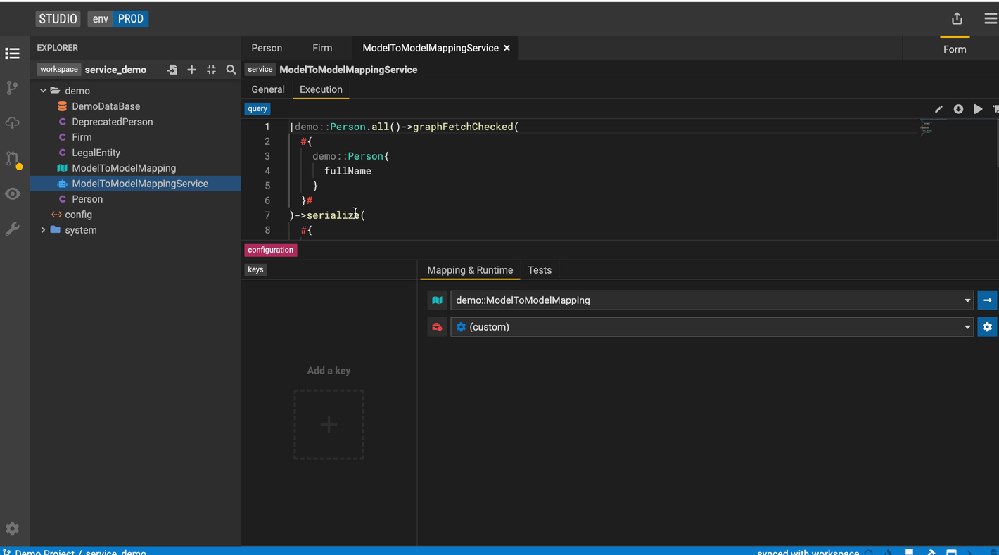

## Create a Service

Build services on top of data queries to consume modeled data systematically. To create a service select **New Service** from the drop down menu to launch the **Service Editor**.

### General Tab

In the **General** tab of the Service Editor, users can specify metadata of their service including the service URL, documentation and owners. URL parameters can be directly defined within the {} sytnax.

   

### Execution Tab

In the execution tab, users can create and edit their service query. By hitting the pencil icon button, users can edit the query using the [Query Builder](./query-tutorial.md). Users can make changes to the query either in the user-friendly form mode or in text mode. 

Additonally the bottom panel lets you define your execution context which represents the mapping and runtime used when executing your query, 

**Multi** Executions lets you use a service parameter to decide what execution context (mapping, runtime) to use. You can switch between multi and single using the top right icon on the context panel. 

   

### Tests Tab

This panel lets you define tests for the services you write by specifying test data, serialization format of your test and the assertions. 

### See features in action

#### Create a Service

#### Create a multi execution service

## Create a Service Test 
### Create connection test data
Click the `generate` button to automatically generate test data if possible. Otherwise, please manually create test data.
#### Relational
Add relational data tables based on databases to which the service's mapping connects. 
It's unnecessary to provide all columns with test data.
The columns used in the service, however, require test data. Besides, the primary keys have to be distinct.

#### External Format (M2M)
Click the `generate` button to automatically generate test data if possible. Otherwise, kindly manually provide test data for the source class's properties that serve as 
the foundation for the properties used in the service. e.g. As shown in the video, _Firm's name is used in the service, which comes from Firm's legalName. Therefore, manually providing test data for legalName will be sufficient if the `generate` button is not working.

#### Data element
More examples of different types of Data element creation could be found [here](#create-a-data-element).

#### Service Store

### Relational

### Model to Model

### Service Store

### With Data Element

### With Parameters

## Promote a model-to-model mapping query to a service

1. Create a model-to-model mapping (find instructions here) and select the **Promote to Service** icon.

2. Add a name for the service and hit create to launch the Service Editor.

## Promote a relational-to-model query to a service

This feature is not yet supported.

## Consume a Service

Consume data services via **executable service JAR files**. As part of the project build, an executable JAR file is generated for each service defined in the project. The executable service JAR file will be published in the Gitlab project that stores the data model code. The JAR file can be consumed by any Java application.

## Creating and Consuming a service execution JAR file

### Create and locate a JAR file

See below steps how to create and locate an executable JAR file for consumption in Studio.

1. Create a data service. Find instructions here.

2. Sync workspace.

3. Navigate to **Workflow Builds**.

4. Wait for the build to complete successfully.

5. Expand the generated workflow build to view the workflow details and click on **verify snapshot** to open the associated Gitlab pipeline.

6. In Gitlab, click on **Browse** under the Job artifacts.

7. Click on **artifacts**.

8. Locate the execution jar file and download it.

## Deploy JAR file

The executable JAR file can be used as a dependency to execute your service.

List the JAR file as a dependency in the Java application. For production use cases, the recommendation is to fetch the JAR file from a published repository (such as the public Maven repo).

## See features in action

## More
- [Legend concepts](../concepts/legend-concepts)
- [Reference documentation](../reference/legend-language)
