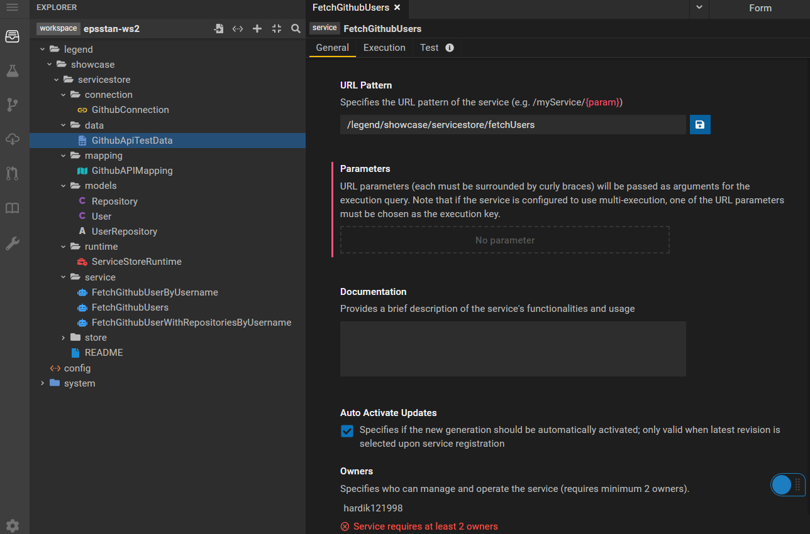
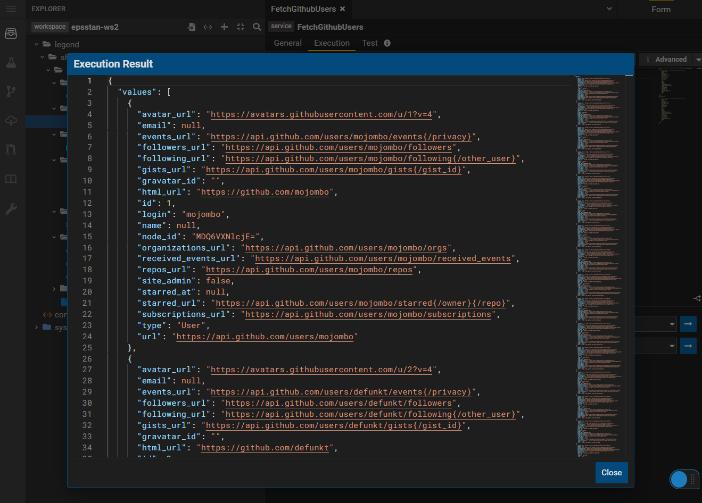

# Service Store   

This tutorial demonstrates the uses of "Service Store" 

## Requirements 

* An installation of Legend with the following components :
    * Studio 
    * Engine 
    * SDLC

* Familiarity with the following Legend concepts :
   * Data modeling with classes, associations 
   * Data modeling with stores, mappings, connections and runtimes 
   * Data modeling with Legend services 
  
Installation instructions can be found here https://legend.finos.org/docs/getting-started/installation-guide

## Example 
  
Legend Studio Project - https://gitlab.com/finosfoundation/legend/showcase/legend-showcase-service-store 

## Setup 

N/A

## Tutorial 

In Legend, a ```Store``` is a "system" that stores data. A common store is a relational database like say Postgres. 

But data is stored and served by other systems that are not databases. A ```ServiceStore``` treats a REST/HTTP based API (or "service") as a store of data.

This allows users to model and access data the same way irrespective of whether the data is from a relational database or a REST API.  

With this definition in place, we can query a GraphQL server that implements the above types, as follows :

### 1. Basic modeling

We start with a simple model of ```User```s and ```Repositories```. This tutorial demonstrates how we map these logical concepts to the [Github API](https://docs.github.com/en/rest?apiVersion=2022-11-28).

```
// A user is associated with one/more repositories

Class legend::showcase::servicestore::models::Repository
{
  id: Integer[1];
  name: String[1];
  full_name: String[1];
  private: Boolean[1];
}

Class legend::showcase::servicestore::models::User
{
  name: String[0..1];
  email: String[0..1];
  login: String[1];
  id: Integer[1];
  node_id: String[1];
  avatar_url: String[1];
  gravatar_id: String[1];
  // elided ... 
  site_admin: Boolean[1];
  starred_at: String[0..1];
}

Association legend::showcase::servicestore::models::UserRepository
{
  user: legend::showcase::servicestore::models::User[0..1];
  repositories: legend::showcase::servicestore::models::Repository[*];
}
```

### 2. Service Store 

The ```ServiceStore``` DSL is how we describe the logical shape of an API or "service" that provides data.

```
###ServiceStore
ServiceStore legend::showcase::servicestore::store::GithubApis
(
  Service UsersApi
  (
    path : '/users';
    method : GET;
    response : [legend::showcase::servicestore::models::User <- legend::showcase::servicestore::store::GithubApisBinding];
    security : [];
  )
  ServiceGroup UserApiGroup
  (
    path : '/users';

    Service UserApi
    (
      path : '/{username}';
      method : GET;
      parameters :
      (
        username : String ( location = path )
      );
      response : legend::showcase::servicestore::models::User <- legend::showcase::servicestore::store::GithubApisBinding;
      security : [];
    )
    Service RepoApi
    (
      path : '/{username}/repos';
      method : GET;
      parameters :
      (
        username : String ( location = path )
      );
      response : legend::showcase::servicestore::models::Repository <- legend::showcase::servicestore::store::GithubApisBinding;
      security : [];
    )
  )
)
```

In the example above, we declare a "service" called ```UserApi``` that is accessible over an HTTP path ```/users/{username}``` and returns data that can be mapped to the logical model class ```legend::showcase::servicestore::models::User```

### 3. Binding 

A binding is how we bind to an eternal data format. The ```Service``` definition points to a ```Binding```. 

```
Service UserApi
    (
      path : '/{username}';
      method : GET;
      parameters :
      (
        username : String ( location = path )
      );
      response : legend::showcase::servicestore::models::User <- legend::showcase::servicestore::store::GithubApisBinding;
      security : [];
    )
```

The definition of the binding declares that the "service" returns data of type JSON.

```
###ExternalFormat
Binding legend::showcase::servicestore::store::GithubApisBinding
{
  contentType: 'application/json';
  modelIncludes: [
    legend::showcase::servicestore::models::User,
    legend::showcase::servicestore::models::Repository
  ];
}
```

### 4. Mapping

Just as with other stores in Legend, the logical model is mapped to the logical definition of the store.

```
###Mapping
Mapping legend::showcase::servicestore::mapping::GithubAPIMapping
(
  *legend::showcase::servicestore::models::User[user]: ServiceStore
  {
    ~service [legend::showcase::servicestore::store::GithubApis] UsersApi
    ~service [legend::showcase::servicestore::store::GithubApis] UserApiGroup.UserApi
    (
      ~request
      (
        parameters
        (
          username = $this.login
        )
      )
    )
  }
  // elided ...
  
  legend::showcase::servicestore::models::UserRepository: XStore
  {
    user[repo, user]: $that.login == $this.username,
    repositories[user, repo]: $that.username == $this.login
  }
)
```

In the example above, we map the logical class ```legend::showcase::servicestore::models::User``` to the data returned by the ```UsersApi```. 

We also map the class to the data returned by the ```UserApiGroup.UserApi```. Since this service definition accepts a ```username``` parameter, we map the parameter as well. 

```
TODO - Update the explanation of parameter mapping and also describe XStore
```

### 5. Connection 

So far we have modeled a logical "service". Using the ```Connection``` we describe a specific physical service. 

```
###Connection
ServiceStoreConnection legend::showcase::servicestore::connection::GithubConnection
{
  store: legend::showcase::servicestore::store::GithubApis;
  baseUrl: 'https://api.github.com';
}
```
In the above example, we declare that we want to consume data from the Github API hosted at ```https://api.github.com```.

For production use cases, the ```Connection``` should include a definition of the authentication protocol to be used when connecting to the service.

### 6. Legend Service

Finally, we have a "Legend Service" that groups all the above concepts.

```
###Service
Service legend::showcase::servicestore::service::FetchGithubUsers
{
  pattern: '/legend/showcase/servicestore/fetchUsers';
  owners:
  [
    'hardik121998'
  ];
  documentation: '';
  autoActivateUpdates: true;
  execution: Single
  {
    query: |legend::showcase::servicestore::models::User.all()->graphFetch(#{legend::showcase::servicestore::models::User{avatar_url,email,events_url,followers_url,following_url,gists_url,gravatar_id,html_url,id,login,name,node_id,organizations_url,received_events_url,repos_url,site_admin,starred_at,starred_url,subscriptions_url,type,url}}#)->serialize(#{legend::showcase::servicestore::models::User{avatar_url,email,events_url,followers_url,following_url,gists_url,gravatar_id,html_url,id,login,name,node_id,organizations_url,received_events_url,repos_url,site_admin,starred_at,starred_url,subscriptions_url,type,url}}#);
    mapping: legend::showcase::servicestore::mapping::GithubAPIMapping;
    runtime: legend::showcase::servicestore::runtime::ServiceStoreRuntime;
  }
```

### 7. Execution

When the above service is executed, Legend connects to the Github API via the ```Connection```, fetches the data and maps it to the logical domain classes.  





## Reference 

Reference documentation on the design/implementation of the ServiceStore integration can be found [here](https://github.com/finos/legend-engine/tree/master/docs/store/extensions/ServiceStore)

## Code 

Legend Engine source code is in the Maven modules named ```legend-engine-xt-servicestore-XXXX```
