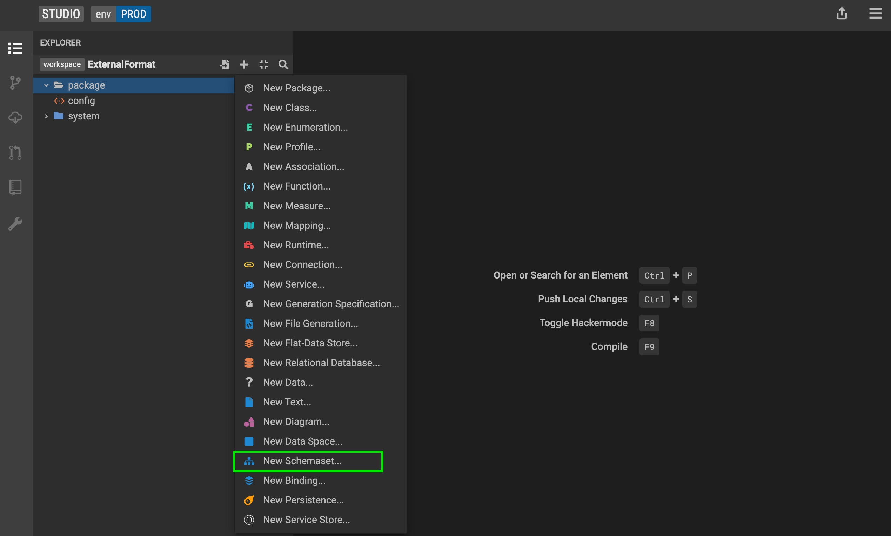
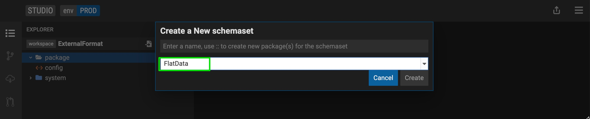
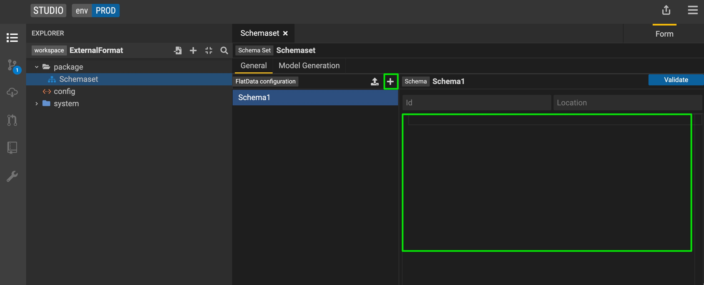
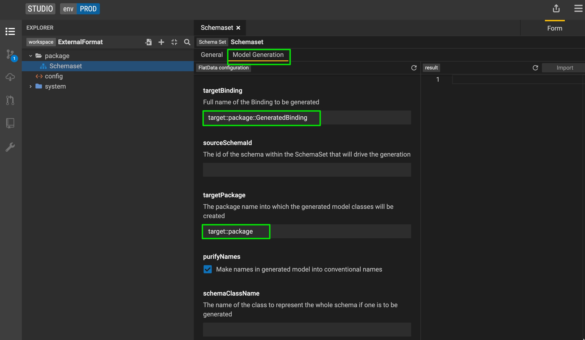
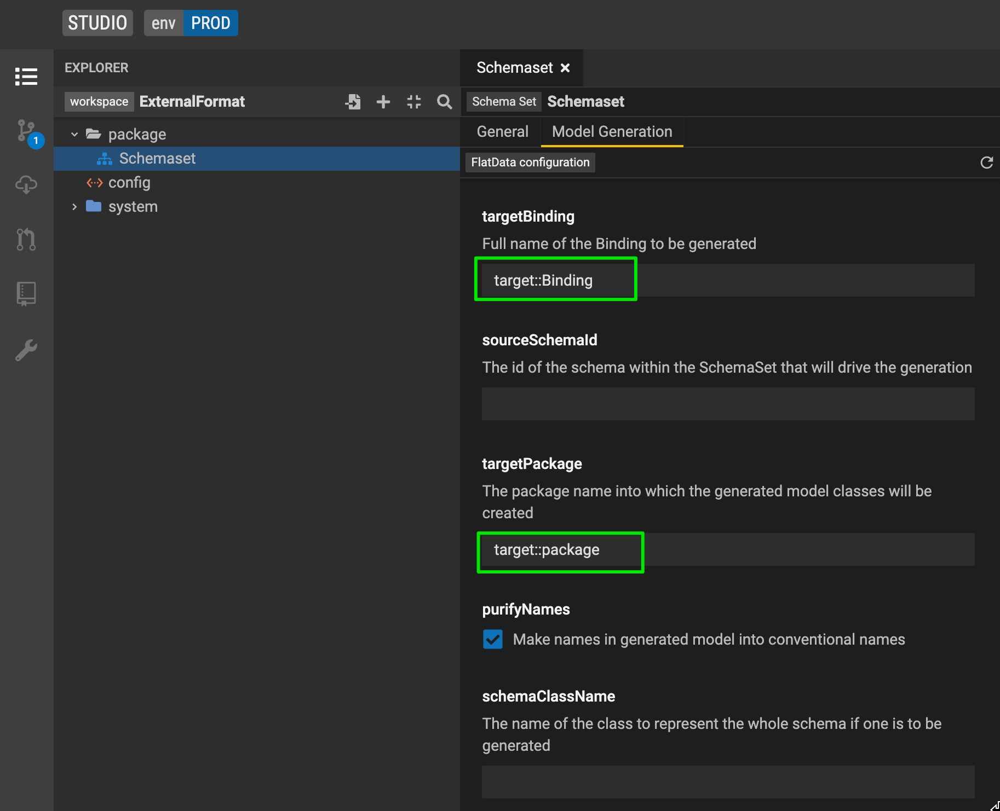

## Connect your model to semi-structured files

### External Format

External Format allows you to define a formal schema (eg : XSD, Json Schema) of your data using and bind this formal schema to your Studio model. External Format should be used for anything related to a format.

#### A) Starting with a data schema

**Step 1:** Create Schemaset

1. Create a <kbd>New SchemaSet</kbd>
    
2. Provide a name for the SchemaSet and select Flatdata as the type from the drop-down list
    
3. Add the schema definition with the <kbd>+</kbd> icon and add add your schema definition in the box 
     
4. (Optional for flatdata) Provide id and location for your schema

**Step 2:** Generate corresponding models and binding

1. Navigate to the <kbd>Model Generation</kbd> tab
    

2. Provide **targetPackage** (the package under which the classes would be generated) and **binding path** (path for the generated binding)
    

3. Click the <kbd>Generate</kbd> button. You should be able to preview the classes that will be generated.

4. If the preview looks good, click <kbd>Import</kbd> and the classes will be added to your project

5. If your flatdata schema has multiple sections and you want to generate a wrapper class linking all record classes, you can do so by providing a 'schemaClassName'

**Step 3:** Create a new service

1. When working with external formats you need to use [internalize](../overview/legend-glossary.md/#internalize) instead of all queries. Internalize can be chained with **checked()**, **graphFetch()**, **graphFetchChecked()** depending on the requirements. See [reference documentation](https://github.com/finos/legend-engine/blob/master/docs/queries/queries.md#checked-graphfetch-graphfetchchecked-graphfetchunexpanded-graphfetchcheckedunexpanded) for details.

2. When defining a service with [internalize](../overview/legend-glossary.md/#internalize), you don't need a mapping or runtime. You will only need to define a query (currently supported via [Text Mode](../overview/legend-features.md/#text-mode) only).

3. Define your service with query using [internalize](../overview/legend-glossary.md/#internalize). You can find examples in the [External Format showcase project](../showcases/showcase-projects.md/#user-journey-5-connect-to-data-source), under the 'flatdata' package. 
    
     - Example data: ``String[1]| Person ->internalize(PersonBinding, $data)->serialize(#Person{firstName,lastName}}#);``
        - This query accepts input as a parameter named data. Query uses internalize function to deserialize this data into Person instances which are then serialized using the serialize function. 

4. Define tests for your service. You do not need to provide a connection test data as there are no connections. Your test data goes as a parameter in the test setup tab, because your query accepts data as a parameter. 

5. Run your test and validate the output.

6. Save your test

**Step 4:** (Optional) Add M2M transform.

1. Create your target model

2. Create an [M2M mapping](../overview/legend-features#model-to-model-mapping) between your target model and source model (auto-generated model from schema)

3. Create a service chaining deserialization and M2M transform:
    - Query data: ``String[1]|TargetPerson.all()->graphFetch(#{TargetPerson{fullName}}#)->from(M2MMapping, Person->getRuntimeWithModelQueryConnection(PersonBinding, $data))->serialize(#{TargetPerson{fullName}}#);``
        - This query accepts input as parameter named data. This input is deserialized into Person instances and wrapped into a runtime by this part of the query ``Person->getRuntimeWithModelQueryConnection(PersonBinding, $data)``. Once deserialization is achieved and generated instances are wrapped into runtime, the query executes **from** expression to perform a M2M transform.

4. Define tests for your service. You do not need to provide connection test data because connection is generated implicitly using input. Your test data goes as a parameter in the test setup tab, because your query accepts data as a parameter.

5. Run your test and validate the output.

6. Save your test 

#### B) Starting from a model definition

_Tutorial coming soon._

## More
- [Showcase projects](../showcases/showcase-projects.md)
- [Legend Features](../overview/legend-features.md)
- [Legend Glossary](../overview/legend-glossary.md)
- [Reference documentation](../reference/legend-language.md)
- [Studio tutorials](../tutorials/studio-workspace.md)
- [Query tutorials](../tutorials/query-builder.md)