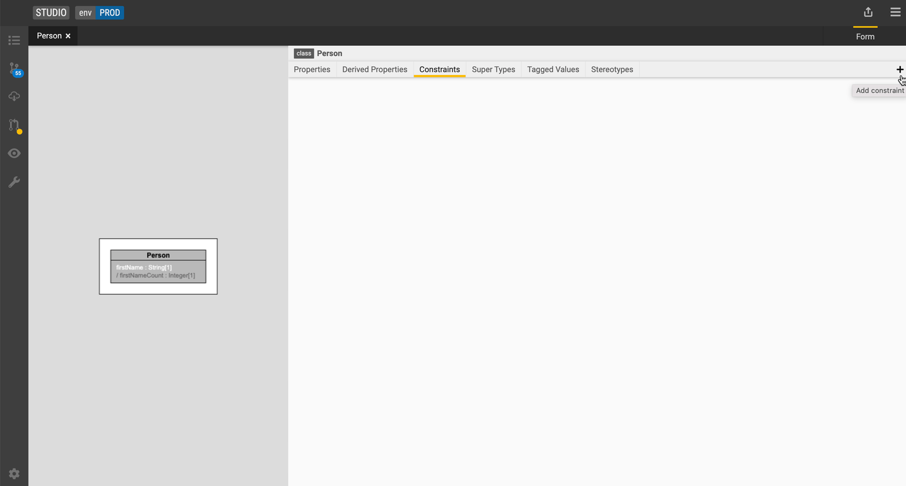

## Workspace

Start working on your data model by creating a [workspace](../concepts/legend-concepts.md/#workspace). A workspace is a copy of a project which can be later merged back into the main project. It represents a branch in the underlying GitLab project. To create a workspace:

1. Select an existing (GitLab) project or select <kbd>+</kbd> to start working on a new one. Please note that the FINOS hosted version of [Legend Studio](https://legend.finos.org/studio/-/setup) does **not** support creating a new project at this time.

2. Create a workspace.

3. Click <kbd>Next</kbd>.

## Group workspace

To create a [group workspace](../concepts/legend-concepts.md/#group-workspace):

1. Follow steps above to create a workspace

2. Check the <kbd>Group workspace</kbd> check box.

## Text Mode

   

To access or exit [Text mode](../concepts/legend-concepts.md/#text-mode): Press `F8` or the hacker icon on the bottom right corner of your scrreen. The bar should change when you open or close Text mode.

To compile your code: Press `F9`

## Diagram

To create a [diagram](../concepts/legend-concepts.md/#diagram), see the[diagram creation](../tutorials/studio-create-diagram.md) tutorial.

## Package

Create a package to start defining model hierarchies to group models into logical concepts.

1. Click the <kbd>+</kbd> icon next on the top left corner to add a new Element.
2. Click <kbd>New package</kbd> to start a model hierarchy. Let's call this package **demo**.

## Data model hierarchy

_Coming soon._

## Project overview

See the [model info & workspace management](../tutorials/studio-manage-model-information.md) tutorial.

## Class

To create a [class](../concepts/legend-concepts.md/#class):

1. Right-click any package on the left side of the panel, or click the `+` near the name of your project.
2. Under `Class view`, you'll see a list of class forms as well as a diagram view of your class. You can add tags, stereotypes, properties, constraints, qualified properties, and super types to your model.

1. Click the <kbd>+</kbd> icon. Make sure the correct package (i.e. **demo**) is selected.
2. Click <kbd>New class</kbd>.

   Let's create 2 classes. One that is called `Person` and another one that is called `Firm`.

   Studio displays a visualization of the class and a tabbed list of the possible model enrichments.

## Property

To create a [property](../concepts/legend-concepts.md/#property):

### Property - primitive data type

1. Select the `Person` and `Firm` class respectively.
2. Go to the <kbd>Properties</kbd> tab and click the <kbd>+</kbd> icon.
3. Type in the name of your property and specify the [data type](../reference/legend-language.md#primitive-types) and [cardinality](../reference/legend-language.md#class).

   For our `Person` class, let's create a property called `firstName` of type `String` with [cardinality](../reference/legend-language.md#class) of 1. Let's add the property `id` of type `String` with the [cardinality](../reference/legend-language.md#class) of 1 in our `Firm` class.

### Property - non-primitive data type

Create a relationship between the **Person** and **Firm** classes.

1. Select the `Firm` class,
2. Create property with the following values:
   - Name: **employees**
   - Type: **Person**
   - Cardinality: **0..**

### Derived property

To create a [derived property](../concepts/legend-concepts.md/#derived-property):

1. Select the `Person` class.
2. Go to the <kbd>Derived properties</kbd> tab and click the <kbd>+</kbd> icon.
3. Type in the name of your property and specify the [data type](../reference/legend-language.md#primitive-types) and [cardinality](../reference/legend-language.md#class).
4. Type in the expression.

   Let's add a derived property called `firstNameCount` using the following expression: `$this.firstName->count()`.

5. Select a return [data type](../reference/legend-language.md#primitive-types) of `Integer` and [cardinality](../reference/legend-language.md#class) of 1.
6. Press **F9** to compile the expression.

### Quality control for properties

#### Type 

_COMING SOON_

#### Multiplicity

_COMING SOON_

#### Enumeration

_COMING SOON_

#### Constraint
_COMING SOON_

## Constraint

To add a [constraint](../concepts/legend-concepts.md/#constraint):

1. Select the `Person` class.
2. Go to the <kbd>Constraints</kbd> tab and click the <kbd>+</kbd> icon.
3. Type in a name for the constraint and the expression.

   Let's add a constraint called `firstNameNotEmpty` using the following expression: `$this.firstName->isNotEmpty()`.

4. Press <kbd>F9</kbd> to compile the expression.

#### Model constraint feedback

When typing constraints and qualified properties, you will get immediate parsing feedback. You can compile your code by pressing `F9`.

## Enumeration

To create an [enumeration](../concepts/legend-concepts.md/#enumeration):

1. Click the <kbd>+</kbd> icon on the left-hand side and select <kbd>Add an enumeration</kbd>.
2. Let's create an enumeration called **CompanyType** with the values **LLC** and **Corporation**.
3. Let's navigate back to our `Firm` class and add a property named **firmType**.
4. Select **CompanyType** for the property type and a [cardinality](../reference/legend-language.md#class) of 1.

## Profile

To create a [profile](../concepts/legend-concepts.md/#profile):

1. Click the <kbd>+</kbd> icon.

2. Click <kbd>New Profile</kbd>.

### Profile tag

Use [tagged values](../concepts/legend-concepts.md/#tagged-value) to add context to your data model. For example, we can add the tagged value **alias** to our `Firm` class to make it easier for others to navigate our data model.

1. In the Profile editor, go to the <kbd>Tags</kbd> tab and click the <kbd>+</kbd> icon.
2. Type in `alias`.

#### Add a tagged value to a class

1. Select the `Firm` class

2. Go to the <kbd>tagged values</kbd> tab

3. Drag and drop the <kbd>Profile</kbd> element into the Tagged Value tab OR hit the <kbd>+</kbd> icon.

4. Select <kbd>alias</kbd>.

5. Type in **Organization**.

The `Firm` class now shows the additional context.

## Stereotype

To create a [stereotype](../concepts/legend-concepts.md/#stereotype):

### Profile stereotype

Annotate your model with labels like _legacy_ or _deprecated_:

1. In the Profile editor, go to the <kbd>stereotypes</kbd> tab and click the <kbd>+</kbd> icon.

2. Type in **deprecated**.

#### Class stereotype

1. Select the `Firm` class

2. Go to the <kbd>Stereotypes</kbd> tab

3. Drag and drop the <kbd>Profile</kbd>element into the Stereotypes tab OR hit the <kbd>+</kbd> icon.

4. Select **deprecated**.

The `Firm` class now shows the additional metadata information.

## Supertype

To create a [supertype](../concepts/legend-concepts.md/#supertype), let's create a new class called `LegalEntity`.

1. Moving back to the `Firm` class, go to the <kbd>Super types</kbd> tab and click the <kbd>+</kbd> icon.
2. Select the `LegalEntity` class from the dropdown.

   The model visualization on the left now shows the **LegalEntity** class as a super type of **Firm**.

## More
- [Legend concepts](../concepts/legend-concepts)
- [Reference documentation](../reference/)

