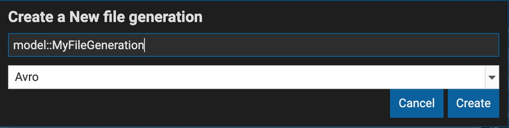

## [File Generation](../concepts/legend-concepts.md/#file-generation)

[File generation](../concepts/legend-concepts.md/#file-generation) lets you generate your models in other codes or schemas.

### Create a File Generation

To create a file generation, first select the generation type that will be generated from your model.

### File Generation editor

_Tutorial coming soon._

### Using your generated files

If you want your file generations to generate files as part of your build, you can specify them in your [Generation specification](../concepts/legend-concepts.md/#generation-specification) element.

## [Generation Specification](../concepts/legend-concepts.md/#generation-specification)

### Generation Specification editor

_Tutorial coming soon._

### Generating your models and files

_Tutorial coming soon._

## More
- [Legend concepts](../concepts/legend-concepts)
- [Reference documentation](../reference/legend-language)