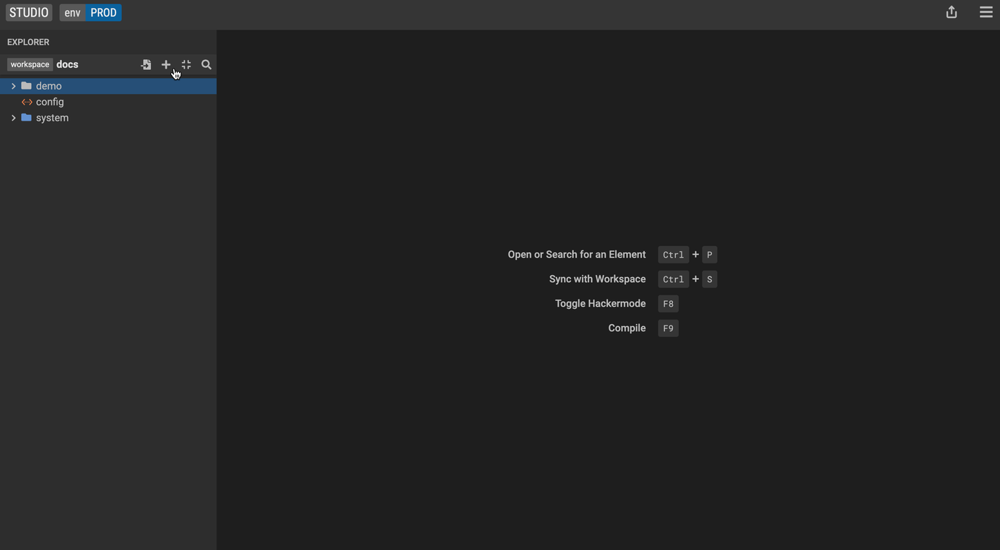

## Create a Mapping between source and target class

Let's start by defining the target class, for which we would like to create the mapping.

1. Create a new class called `NewPerson`.
2. Add a property to `NewPerson` called **name**. Make the property a string with a [cardinality](../reference/legend-language.md#class) of 1.
3. Add a property to the existing `Person` class called **lastName**. Make the property a string with a [cardinality](../reference/legend-language.md#class) of 1.
4. Click the<kbd>+</kbd> icon and select<kbd>New Mapping</kbd> to create a new mapping called **NewPersonMapping**.
5. Drag and drop the **NewPerson** target class into the **Add a mapping element** section on the left.
6. Hit the <kbd>Create</kbd> button using the default setting.

Define the source class for our mapping and specifiy the transformation.

7. Drag and drop the `Person` source class into the <kbd>Choose a source</kbd> section on the right.
8. To specify the transformation, add the following expression for the **name** property: `$src.firstName + ' ' + $src.lastName`. You can also drag and drop the **firstName** and **lastName** properties from the `Person` source class into the function panel.

## Create a Mapping Test

Legend provides an execution feature to run queries, constraints, and model-to-model/model-to-database transformations. You can use live data (pulled from physical data stores) or generated sample data as inputs to the executions, and review the results to test your model as you build it.

You can save these tests and continue to enhance your data models with the comfort that your changes can be tested against expected results.

It is good practice to add test to any mapping that you specify:

1. Right click on the `NewPerson` class and select<kbd>Test</kbd>. Alternatively, you can click on the <kbd>+</kbd> icon in the bottom left panel to add a test.

Create a sample query to test if the model-to-model mapping executes correctly:

2. Click on the **pencil** icon to edit your query.
3. Create a very simple query. Make sure to select the <kbd>Graph fetch</kbd> option for model-to-model queries. Studio does not currently support Projection queries on top of model-to-model mappings. Drag and drop the **name** property from the explorer panel into the fetch structure panel.
4. Hit the <kbd>Save query</kbd> button.

_Refer to the [create a query](../tutorials/query-tutorial.md/#create-a-query) section of the docs for more detailed information about the **Query Editor**_

Studio generates sample input data for your defined query. You can also modify it if you want:

5. Hit the **generate Result** icon.
6. Congrats! You now have a mapping test and can run it any time to validate the execution of your model-to-model mapping.

## Execute a Model-to-Model Mapping

1. Drag the <kbd>Execute</kbd> panel up from the bottom of Studio screen.

2. Select the edit button to select the `NewPerson` class for testing. Then select the attribute(s) to test. The source model is auto-populated.

3. Execute the mapping and review the results.

4. Save this execution as a test to run as part of the pipeline.

   

You can promote this ad hoc execution to a test by clicking on the **beaker** icon.

### Execute a Model-to-Model Mapping with Constraints

Remember that we can add a [constraint](../tutorials/studio-create-model/#constraint-1) on classes? We can also execute model-to-model mappings with constraints to check if the constraint criteria are violated.

Let's create a constraint on the `NewPerson` class that checks if the name value is empty `$this.name-> == ''`

1. Right click on the `NewPerson` class and select <kbd>Execute</kbd>
2. Create a sample query by clicking on the **pencil** icon
3. Drag and drop the **name** property from the explorer panel into the fetch structure panel
4. Select <kbd>Check graph fetch</kbd>
5. Hit the <kbd>Save query</kbd> button
6. Let's remove the **firstName** test data to intentionally violate the constraint criteria that we specified on our `NewPerson` class
7. Hit the <kbd>Execute</kbd> button to execute the defined query

Studio will show a **defect** with the details about the violated constraint. Constraints can be both on source and target classes.

## More
- [Legend concepts](../overview/legend-glossary.md)
- [Reference documentation](../reference/legend-language)