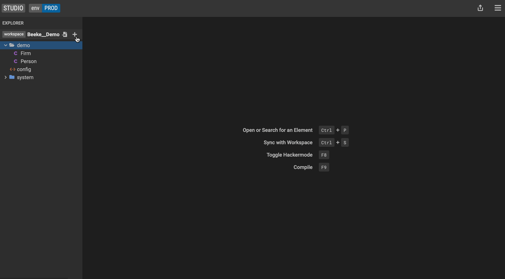

## Profile

To create a [profile](../overview/legend-glossary.md/#profile):

1. Click the <kbd>+</kbd> icon.

2. Click <kbd>New Profile</kbd>.

### Profile tag

Use [tagged values](../overview/legend-glossary.md/#tagged-value) to add context to your data model. For example, we can add the tagged value **alias** to our `Firm` class to make it easier for others to navigate our data model.

1. In the Profile editor, go to the <kbd>Tags</kbd> tab and click the <kbd>+</kbd> icon.
2. Type in `alias`.

#### Add a tagged value to a class

1. Select the `Firm` class

2. Go to the <kbd>tagged values</kbd> tab

3. Drag and drop the <kbd>Profile</kbd> element into the Tagged Value tab OR hit the <kbd>+</kbd> icon.

4. Select <kbd>alias</kbd>.

5. Type in **Organization**.

The `Firm` class now shows the additional context.

## Stereotype

To create a [stereotype](../overview/legend-glossary.md/#stereotype):

### Profile stereotype

Annotate your model with labels like _legacy_ or _deprecated_:

1. In the Profile editor, go to the <kbd>stereotypes</kbd> tab and click the <kbd>+</kbd> icon.

2. Type in **deprecated**.

#### Class stereotype

1. Select the `Firm` class

2. Go to the <kbd>Stereotypes</kbd> tab

3. Drag and drop the <kbd>Profile</kbd>element into the Stereotypes tab OR hit the <kbd>+</kbd> icon.

4. Select **deprecated**.

The `Firm` class now shows the additional metadata information.

## Supertype

To create a [supertype](../overview/legend-glossary.md/#supertype), let's create a new class called `LegalEntity`.

1. Moving back to the `Firm` class, go to the <kbd>Super types</kbd> tab and click the <kbd>+</kbd> icon.
2. Select the `LegalEntity` class from the dropdown.

   The model visualization on the left now shows the **LegalEntity** class as a super type of **Firm**.

## More
- [Showcase projects](../showcases/showcase-projects.md)
- [Legend Features](../overview/legend-features.md)
- [Legend Glossary](../overview/legend-glossary.md)
- [Reference documentation](../reference/legend-language.md)
- [Studio tutorials](../tutorials/studio-workspace.md)
- [Query tutorials](../tutorials/query-builder.md)

