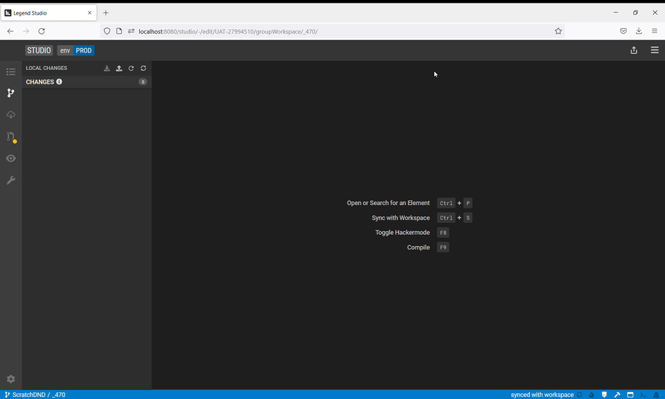
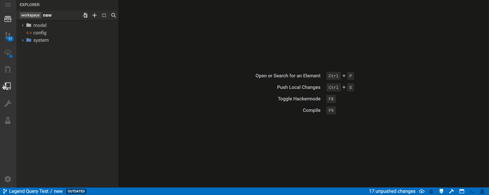

## Review and commit changes

Legend is integrated with the software development lifecycle (SDLC) supported by GitLab, which lets you review and commit changes.

Follow these steps to review and commit a change.

1. Press `Ctrl+S` to sync the local changes to the workspace.

   

2. Select the diff view to review the synced changes in workspace.

   

3. To create a review, click the highlighted icon in the activity bar or press `Ctrl + Shift + M` to go to the review panel. Here you can review the code in the current workspace vs. the committed code.

   

4. After the review is approved, click **Commit**.

   

## Update workspace with latest changes

When the workspace is out of date, Studio provides a notification in the status bar on the bottom left. Click the update button on the sidebar to bring in the latest changes.

## Share and upload recent unsaved local changes via a Patch
 This feature allows you to save (or write) a patch that they can then upload and apply to their local workspace. More details [here](https://github.com/finos/legend-studio/pull/748).

## Resolve a conflict in the workspace

A workspace update may result in a conflict. Studio will open a new view to aid in resolving the conflict.

1. Choose one of the following actions:

   - **Discard the changes**: the workspace changes are removed.

   - **Review the changes**: the workspace changes will be applied on top of the latest version.

   

2. If you chooose to review changes, review and press `F9` to compile.

3. Once the changes compile successfully, either accept or discard the changes.

   

## Release a new version of your data model and make it available to consumers

### Test new data model versions
You can depend on another project's "HEAD" version to dynamically pull in and review incoming changes. As a data producer, you can more safely release new project versions because your consumers can test any data model changes before updating to a new released version. 

## Troubleshoot issues with your data model, query or service.

### Navigate quickly to the underlying GitLab project

_Tutorial coming soon._

### Share your project with others in read-only mode

Instead of having to copy the URL of a Studio project to share it with others, you can just click on the 'share project' button in the Project Details view. 

More details and video walkthrough [here](https://github.com/finos/legend-studio/pull/1166).

### Debug/troubleshoot issues with your query by reviewing execution details (Plan View)

_Tutorial coming soon._

### Troubleshoot, inspect your code, and make changes to your data model in Text Mode

_Tutorial coming soon._

## More
- [Showcase projects](../showcases/showcase-projects.md)
- [Legend Features](../overview/legend-features.md)
- [Legend Glossary](../overview/legend-glossary.md)
- [Reference documentation](../reference/legend-language.md)
- [Studio tutorials](../tutorials/studio-workspace.md)
- [Query tutorials](../tutorials/query-builder.md)
