## Create a workspace

Start working on your data model by creating a workspace. A workspace is a copy of a project which can be later merged back into the main project. It represents a branch in the underlying GitLab project. To create a workspace:

1. Select an existing (GitLab) project or select **+** to start working on a new one. Please note that the FINOS hosted version of [Legend Studio](https://legend.finos.org/studio/-/setup) does **not** support creating a new project at this time.

2. Create a workspace.

3. Click **Next.**
   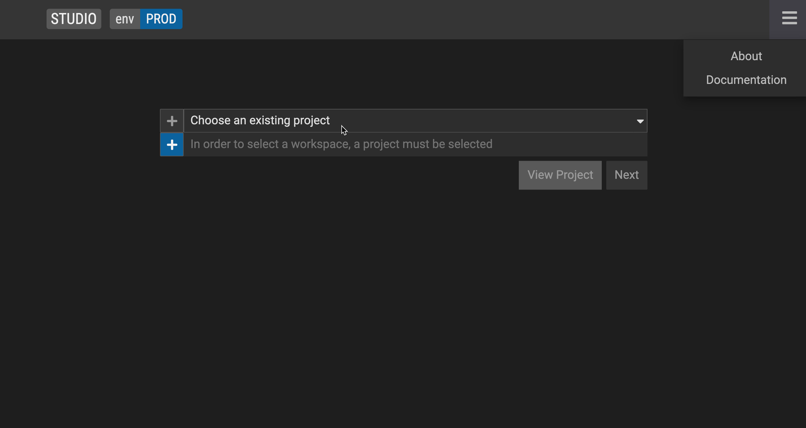

## Create a group workspace

1. Follow steps above to create a workspace

2. Check the **Group Workspace** check box.

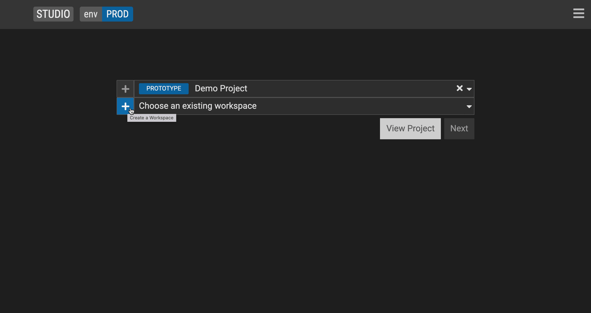

## Access Text Mode

_[TODO: add screenshot]_

To access or exit Text mode: Press `F8` or the hacker icon on the bottom right corner of your scrreen. The bar should change when you open or close Text mode.

To compile your code: Press `F9`

## Create a data model

### Create a model diagram

_COMING SOON_

### Use a diagram to create a data model

_COMING SOON_

### Define a new model package

Create a package to start defining model hierarchies to group models into logical concepts.

1. Click the **+** icon next on the top left corner to add a new Element.
2. Click **New package** to start a model hierarchy. Let's call this package **demo**.

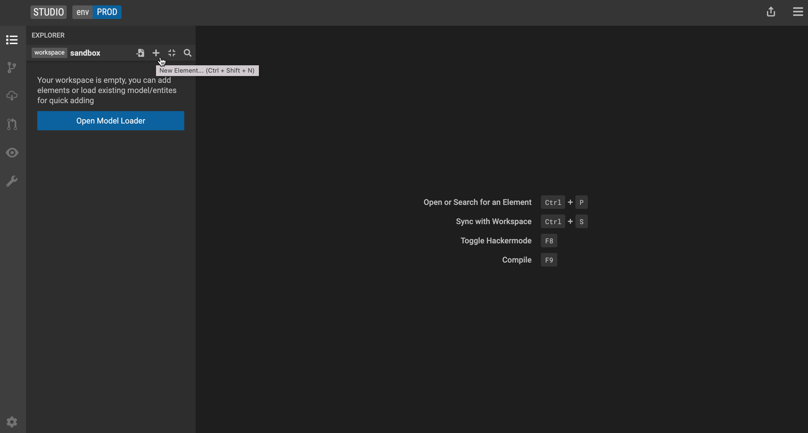

## Define a data model hierarchy

_COMING SOON_

## Edit project overview

_COMING SOON_

## Create a class, enumeration or profile

To create a class, enumeration or profile:

1. Right-click any package on the left side of the panel, or click the `+` near the name of your project.
2. Under `Class view`, you'll see a list of class forms as well as a diagram view of your class. You can add tags, stereotypes, properties, constraints, qualified properties, and super types to your model.

## Define a new class

1. Click the **+** icon (make sure your **demo** package is selected).
2. Click **New Class**.

   Let's create 2 classes. One that is called `Person` and another one that is called `Firm`.

   Studio displays a visualization of the class and a tabbed list of the possible model enrichments.

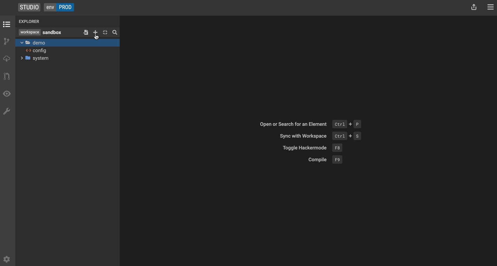

## Add a property (primitive data type)

1. Select the `Person` and `Firm` class respectively.
2. Go to the **Properties** tab and click the **+** icon.
3. Type in the name of your property and specify the [data type](../reference/legend-language.md#primitive-types) and [cardinality](../reference/legend-language.md#class).

   For our `Person` class, let's create a property called `firstName` of type `String` with [cardinality](../reference/legend-language.md#class) of 1. Let's add the property `id` of type `String` with the [cardinality](../reference/legend-language.md#class) of 1 in our `Firm` class.

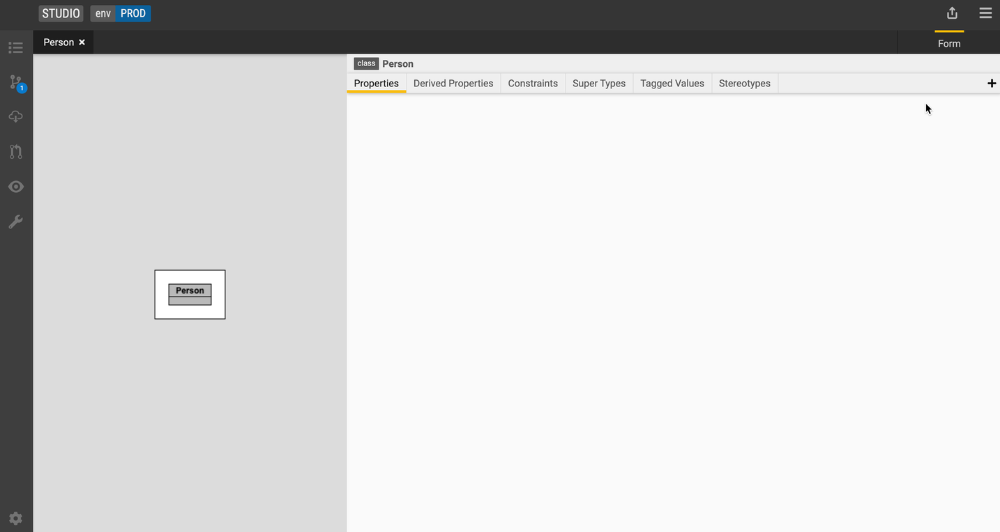

## Add a derived property

1. Select the `Person` class.
2. Go to the **Derived Properties** tab and click the **+** icon.
3. Type in the name of your property and specify the [data type](../reference/legend-language.md#primitive-types) and [cardinality](../reference/legend-language.md#class).
4. Type in the expression.

   Let's add a derived property called `firstNameCount` using the following expression: `$this.firstName->count()`.

5. Select a return [data type](../reference/legend-language.md#primitive-types) of `Integer` and [cardinality](../reference/legend-language.md#class) of 1.
6. Press **F9** to compile the expression.

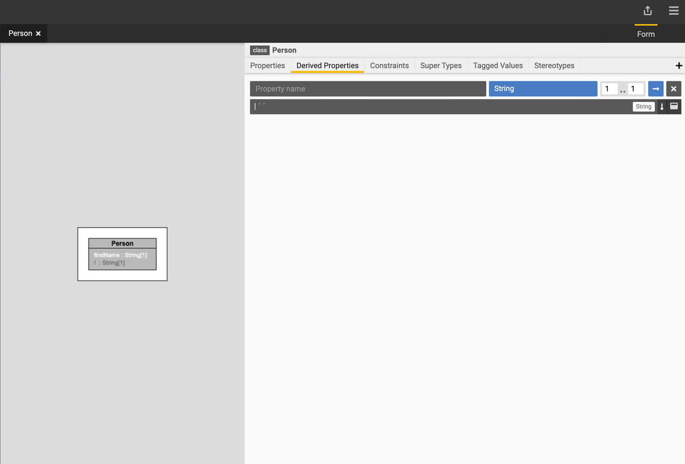

## Add a constraint

1. Select the `Person` class.
2. Go to the **Constraints** tab and click the **+** icon.
3. Type in a name for the constraint and the expression.

   Let's add a constraint called `firstNameNotEmpty` using the following expression: `$this.firstName->isNotEmpty()`.

4. Press **F9** to compile the expression.

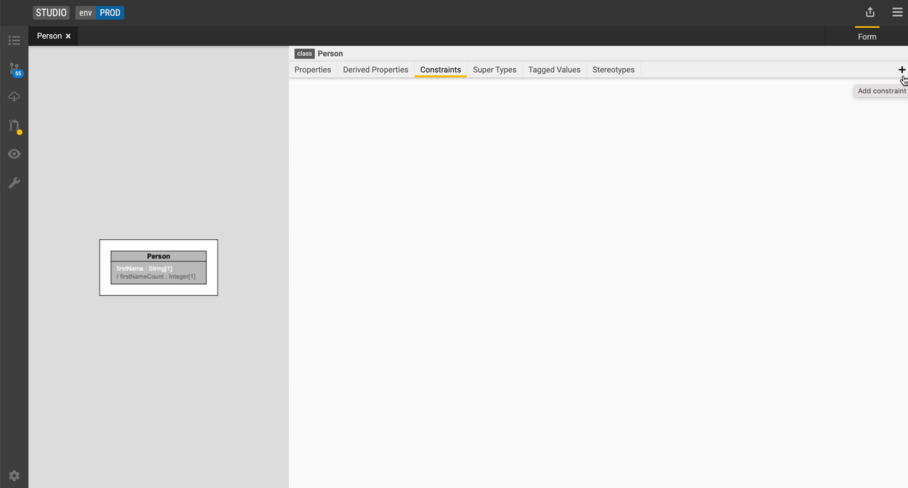

## Add a quality control to a property

### Type as a quality control

_COMING SOON_

### Multiplicity as a quality control

_COMING SOON_

### Enumeration as a quality control

_COMING SOON_

### Constraints as a quality control

_COMING SOON_

### Model constraint feedback

When typing constraints and qualified properties, you'll get immediate parsing feedback. You can compile your code by pressing `F9`.

_ADD SCREENSHOT_

### Create a Profile

1. Click the **+** icon.

2. Click **New Profile**.

#### Create a tag in your Profile

Use tagged values to add context to your data model. For example, we can add the tagged value **alias** to our `Firm` class to make it easier for others to navigate our data model.

1. In the Profile editor, go to the **Tags** tab and click the **+** icon.

2. Type in `alias`.

#### Add a tagged value to a class

1. Select the `Firm` class

2. Go to the **Tagged Values** tab

3. Drag and drop the **Profile** element into the Tagged Value tab OR hit the **+** icon.

4. Select **alias**.

5. Type in **Organization**.

The `Firm` class now shows the additional context.

#### Create a stereotype in your Profile

Annotate your model with labels like _legacy_ or _deprecated_:

1. In the Profile editor, go to the **Stereotypes** tab and click the **+** icon.

2. Type in **deprecated**.

#### Add a stereotype to a class

1. Select the `Firm` class

2. Go to the **Stereoptypes** tab

3. Drag and drop the **Profile** element into the Stereotypes tab OR hit the **+** icon.

4. Select **deprecated**.

The `Firm` class now shows the additional metadata information.

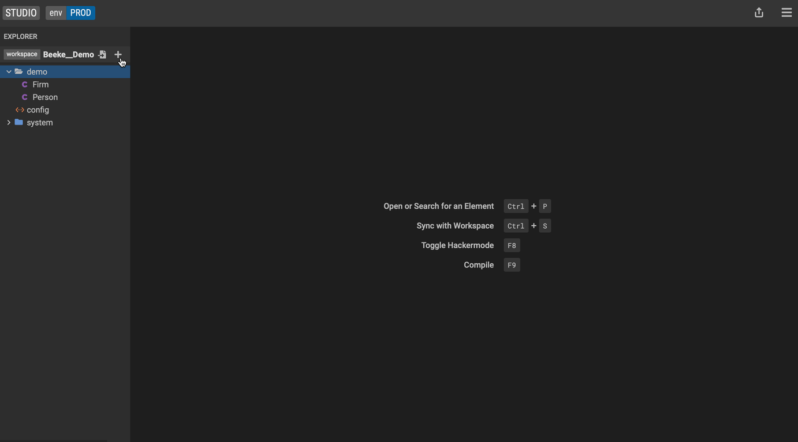

### Create and add an enumeration

1. Click the **+** icon on the left-hand side and select **Add an enumeration**.
2. Let's create an enumeration called **CompanyType** with the values **LLC** and **Corporation**.
3. Let's navigate back to our `Firm` class and add a property named **firmType**.
4. Select **CompanyType** for the property type and a [cardinality](../reference/legend-language.md#class) of 1.

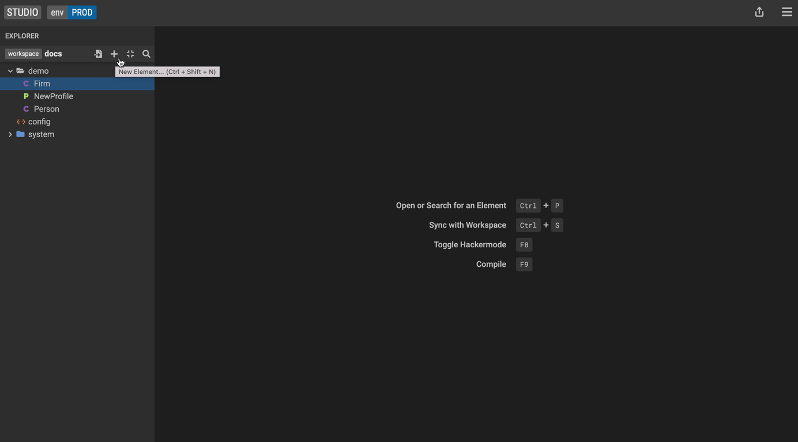

### Add a supertype

Let's create a new class called `LegalEntity`.

1. Moving back to the `Firm` class, go to the **Super Types** tab and click the **+** icon.
2. Select the `LegalEntity` class from the dropdown.

   The model visualization on the left now shows the **LegalEntity** class as a super type of **Firm**.

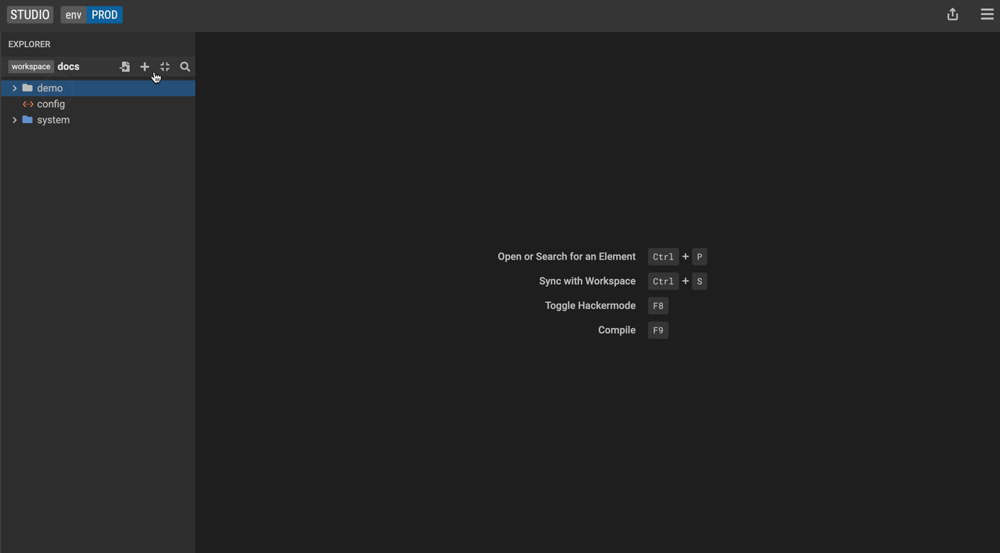

### Add a property (non-primitive data type)

Create a relationship between the **Person** and **Firm** classes.

1. Select the `Firm` class,
2. Create property with the following values:
   - Name: **employees**
   - Type: **Person**
   - Cardinality: **0..**

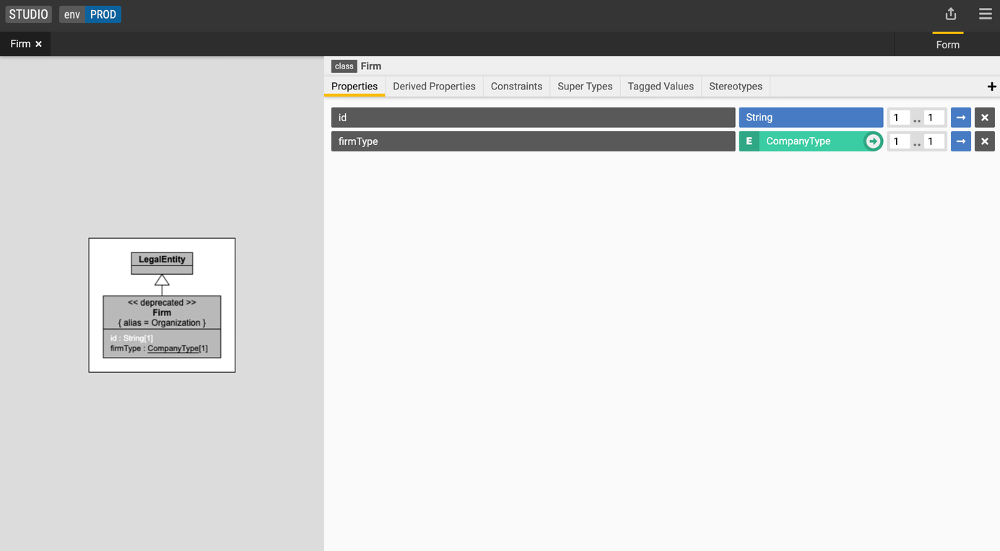

## Create a Data Element
Data Elements are top level elements that define test data for store/external formats. They are useful for sharing test data among different tests.
### Relational
Test data for relational is defined through csv values for each table, which is to be used when a user is sourcing data from relational databases. The name of the schema, the table, and the related CSV values must all be specified. Besides, the primary keys have to be distinct.


### External Format(m2m)
Test data for model to model could be defined through external format. Provide test data for properties of source classes that are being used in the mapping.


### Service Store
`UrlPath` in `Service Request Pattern` = Root path defined in the `Service Group` of `Service Store` and the path specified in the service for which this data element is created.
In `Service Response Definition` panel, provide test data for all used properties in the chosen format. 
Please check the demo video below for futher information.


## Create a Diagram
To get started, click the **+** to open the **New Element** drop down menu on the left-hand side and select **Add a new diagram**.

### Add classes to the diagram

There are three ways to add classes to the diagram

1. Select and drag existing classes from the explorer view to the diagram one at a time.

2. Double click in an empty space in the diagram editor, define a class name and hit enter.

3. Select the **+** icon on the left hand-side and click into an empty space in the diagram editor.

### Add properties to classes in the diagram

To add **properties** to classes in the diagram, select the class and hit <kbd>Alt</kbd> + &darr;.

### Build data relationships in the diagram

There are two ways how to define data relationships in the diagram editor.

1. Select the **Property Tool** or hit **P** to connect classes.

2. Select the **Inheritance Tool** or hit **I** to define a supertype relationship.

### Move and resize the diagram

To **move** the diagram, either select the **Pan Tool** from the left-hand side menu, hit **M** or hold down the right mouse button.The mouse cursor will change to a hand symbol.

To **resize** the diagram, either select **Zoom In/Out** from the left-hand side menu, hit **Z** or choose a zoom percentage from the drop down on the top right corner.

### Move elements in the diagram

To move elements in the diagram hold down the left mouse button. The mouse cursor will change to a hand symbol.

### Review diagram hotkeys

To review all diagram hotkeys, click on the **Show Hotkeys** button from the left-hand side menu.

### Delete a diagram

Right click on the diagram element in the explorer view and select **delete**.

### See features in action


## Create a Model-to-Model Mapping

Create a model transformation using model-to-model mappings. Model transformations are used to connect different models.

## Create a Mapping between source and target class

Let's start by defining the target class, for which we would like to create the mapping for.

1. Create a new class called `NewPerson`.
2. Add a property to `NewPerson` called **name**. Make the property a string with a [cardinality](../reference/legend-language.md#class) of 1.
3. Let's also add a property to our existing `Person` class called **lastName**. Make the property a string with a [cardinality](../reference/legend-language.md#class) of 1.
4. Click the **+** icon and select **New Mapping** to create a new mapping called **NewPersonMapping**.
5. Drag and drop the **NewPerson** target class into the **Add a mapping element** section on the left.
6. Hit the **create** button using the default setting.

Let's define the source class for our mapping and specifiy the transformation.

7. Drag and drop the `Person` source class into the **choose a source** section on the right.
8. To specify the transformation add the following expression for the **name** property: `$src.firstName + ' ' + $src.lastName`. You can also drag and drop the **firstName** and **lastName** properties from the `Person` source class into the function panel.

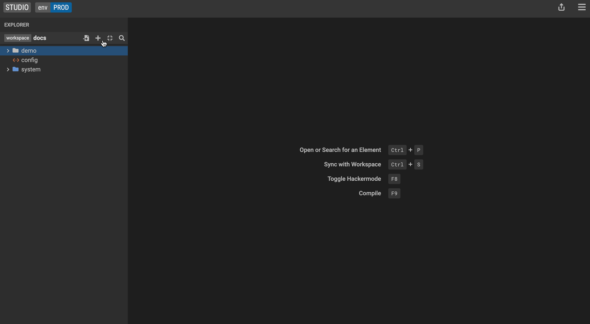

## Add a Mapping Test

It is good practice to add test to any mapping that you specifiy. Let's create one.

1. Right click on the `NewPerson` class and select **Test**. Alternatively, you can click on the **+** icon in the bottom left panel to add a test.

We now need to create a sample query to test if our model-to-model mapping executes correctly.

2. Click on the **pencil** icon to edit your query.
3. Let's create a very simple query. First, let's make sure to select the **Graph Fetch** option for model-to-model queries. Studio does not currently support Projection queries on top of model-to-model mappings. Let's drag and drop the **name** property from the explorer panel into the fetch structure panel.
4. Hit the **Save Query** button.

_Please refer to our create a query section of the docs for more detailed information about the **Query Editor** (coming soon!)._

Studio is generating sample input data for your defined query. You can also modify it if you want.

5. Hit the **generate Result** icon.
6. Congrats! You now have a mapping test and can run it any time to validate the execution of your model-to-model mapping.

## Execute a Model-to-Model Mapping

You can also execute a model-to-model mapping directly.

1. Right click on the `NewPerson` class and select **Execute**
2. Create a sample query by clicking on the **pencil** icon.
3. Drag and drop the **name** property from the explorer panel into the fetch structure panel.
4. Select **Check graph fetch**
5. Hit the **Save Query** button
6. Hit the **Execute button** to execute the defined query using the auto-generated data from Studio

You can promote this ad hoc execution to a test by clicking on the **beaker** icon.

### Execute a Model-to-Model Mapping with Constraints

Remember that we can add a [constraint](../tutorials/studio-tutorial#add-a-constraint) on classes? We can can also execute model-to-model mappings with constraints to check if the constraint criteria are violated.

Let's create a constraint on the `NewPerson` class that checksq if the name value is empty `$this.name-> == ''`

1. Right click on the `NewPerson` class and select **Execute**
2. Create a sample query by clicking on the **pencil** icon
3. Drag and drop the **name** property from the explorer panel into the fetch structure panel
4. Select **Check graph fetch**
5. Hit the **Save Query** button
6. Let's remove the **firstName** test data to intentionally violate the constraint criteria that we specified on our `NewPerson` class
7. Hit the **Execute button** to execute the defined query

Studio will show a **defect** with the details about the violated constraint. Constraints can be both on source and target class.

## Connect Data to a Data Model

Connect data to a data model to start querying data leveraging the business-friendly terms and data relationships defined in the data model.

## Create a Relational Database

Define the schema definition of the relational database you wish to connect to the data model.

1. Hit the **+** icon.
2. Select **New Relational Database**
3. Enter the name of the Database, for example **H2DemoDataBase**

The Studio form mode currently does not support defining the Relational Database schema. Please select **Edit in text mode** to continue.

4. Define the database by adding tables, columns and joins.

Please refer to below sample SQL snippet to set up a in-memory H2 demo database.

###Relational
Database demo::H2DemoDataBase
(
Table FirmTable
(
id INTEGER PRIMARY KEY,
legal_name VARCHAR(200)
)
Table EmployeeTable
(
id INTEGER PRIMARY KEY,
firm_id INTEGER,
full_name VARCHAR(200),
country_id INTEGER
)
Table CountryTable
(
id INTEGER PRIMARY KEY,
country_name VARCHAR(200)
)

Join FirmEmployee(EmployeeTable.firm_id = FirmTable.id)
Join EmployeeCountry(EmployeeTable.country_id = CountryTable.id)
)

## Create a Relational Mapping

Map the columns of your relational tables to the properties defined in the data model.

### Define the Relational Mapping

1. Hit the **+** icon.
2. Select **New Mapping**
3. Enter the name of the Mapping, for example **DemoRelationalMapping**
4. Define the mapping target: Drag a class into the editor where it says **Add a mapping element**, for example the `Firm` class. Then select **Create**.
5. Define the mapping source: Drag the **H2DemoDataBase** Relational Database in the editor where it says **Choose a source**.
6. Choose the table specified in the Relational Database schema that contains the columns you wish to map to your data model properties. Let's choose the **FirmTable**.
7. Map the column names on the left-hand side to the property names in the center of the editor screen. Let's map the **legal_name** column to the **legalName** property.

#### Execute the Relational Mapping

To ensure that the mapping has been done correctly and the desired data is actually returned, let's execute the relational mapping.

1. Right click on the class you wish to test execution for. Let's aim to query Firm data by right-clicking on the `Firm` class and selecting **Execute**.
2. Hit the **Edit Query** button to define your test query.
3. Create test data either from SQL or csv.
4. Hit the **Execute** button to test execution.

#### Create Relational Mapping Test

It is good practice to define tests for each of your relational mappings. That way, changes to the model and mappings can be performed more safely.

1. Right click on the class you wish to set up the test for. Let's set up a test for the `Firm` class by right-clicking on it and selecting **Test**.
2. Alternatively, you can select the **+** icon where it says **Let's add some tests!**. Select the class from the dropdown you wish to create the test for.
3. Hit the **Edit Query** button to define your test query.
4. Create test data either from SQL or csv.
5. Hit the **Execute** button to test execution.

You can test all the queries and relational mappings at once by hitting the **Run All Tests** button.

## Create a Connection

Define the Connection details between the relational database and the data model.

1. Hit the **+** icon.
2. Select **New Connection**
3. Enter the name of the Connection, for example **H2DemoConnection**
4. Select **Relational** Model Connection

Start entering the Connection details in the **General** tab. First, choose the **Database type**.

### Database type

Specify the type of relational database you wish to connect to. Studio currently supports:

- H2 (in-memory test database)
- Snowflake
- BigQuery

### Datasource

Specify the connection details of your selected database type.

#### H2

To execute against an in-memory H2 test data base, you would need to define test data by adding SQL to **Test data setup SQL**

#### H2 Embedded

_Coming soon_

#### Static

_More details coming soon_

Specify Static connection details by adding the below details.

- Host
- port
- Database

#### Snowflake

_More details coming soon_

Specify Snowflake connection details by adding the below details.

- Account
- Region
- Warehouse
- Database
- Cloud type

#### BigQuery

_More details coming soon_

Specify BigQuery connection details by adding the below details.

- Project id
- Default dataset

### Authentication

Define how access to the database should be authenticated in the **Authentication** specifications.

#### H2 Default

No further input needed if you select the **H2 Default** authentication specifications.

#### Delegated Kerberos

_More details coming soon_

Specify **Delegated Kerberos** authentication details by adding the below details.

- Server principal

#### Snowflake Public

_More details coming soon_

Specify **Snowflake** authentication details by adding the below details.

- Private key vault reference
- Pass phrase vault reference
- Public user name

#### Gcp Application Default Credentials

_More details coming soon_

Specify **GCP** authentication details.

#### Username password

_More details coming soon_

Specify **Username password** authentication details.

## Create a Runtime

The combination of the relational mapping and the connection details are specified in the **Runtime**.

1. Hit the **+** icon.
2. Select **New Runtime**
3. Enter the name of the Connection, for example **H2DemoRuntime**
4. Select the **relational mapping** you want to specify for your runtime, for example **DemoRelationalMapping**

## Execute Model-to-Model Mapping

Legend provides an execution feature to run queries, constraints, and model-to-model/model-to-database transformations. Use live data (pulled from physical data stores) or generated sample data as inputs to the executions and review the results to test your model as you build it.

You can save these tests and continue to enhance your data models with the comfort that your changes can be tested against expected results.

### Steps to execute a model-to-model mapping

1. Drag the **Execute** panel up from the bottom of Studio screen.

2. Select the edit button to select the `NewPerson` class for testing. Then select the attribute(s) to test. The source model is auto-populated.

3. Execute the mapping and review the results.

4. Save this exection as a test to run as part of the pipeline.

   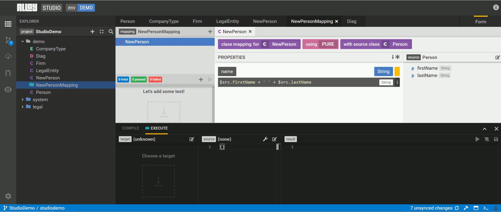

## Create a Service

Build services on top of data queries to consume modeled data systematically. To create a service select **New Service** from the drop down menu to launch the **Service Editor**.

### General Tab

In the **General** tab of the Service Editor, users can specify metadata of their service including the service URL, documentation and owners. URL parameters can be directly defined within the {} sytnax.

   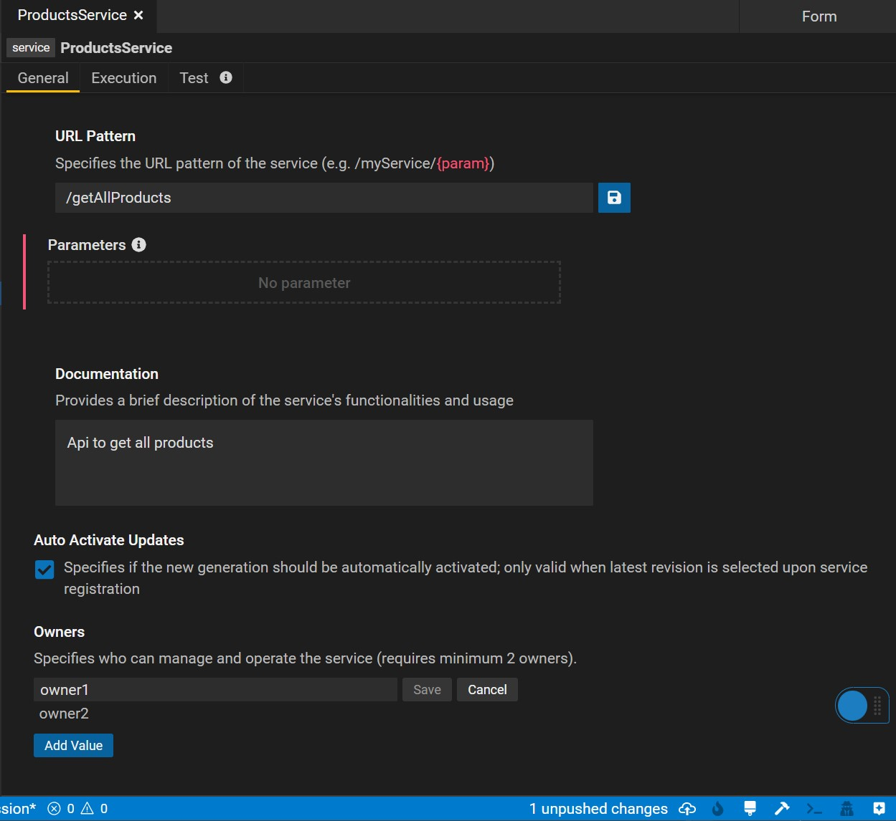


### Execution Tab

In the execution tab, users can create and edit their service query. By hitting the pencil icon button, users can edit the query using the [Query Builder](./query-tutorial.md). Users can make changes to the query either in the user-friendly form mode or in text mode. 

Additonally the bottom panel lets you define your execution context which represents the mapping and runtime used when executing your query, 

**Multi** Executions lets you use a service parameter to decide what execution context (mapping, runtime) to use. You can switch between multi and single using the top right icon on the context panel. 

   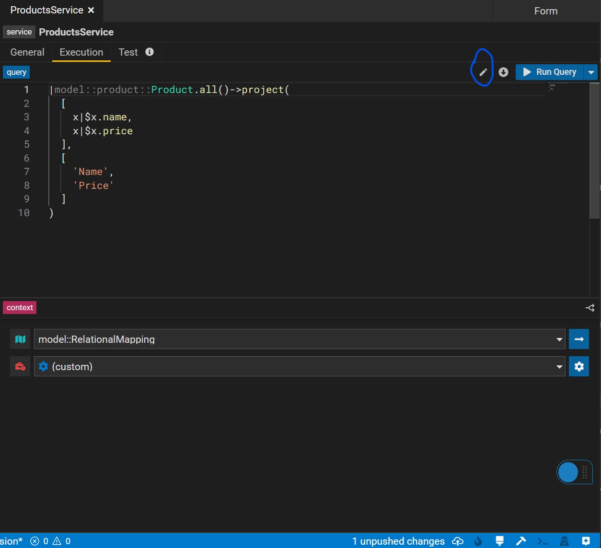


### Tests Tab

This panel lets you define tests for the services you write by specifying test data, serialization format of your test and the assertions. 

### See features in action

#### Create a Service
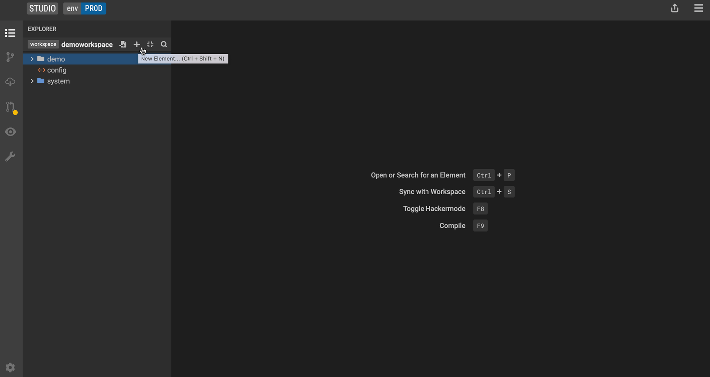

#### Create a multi execution service
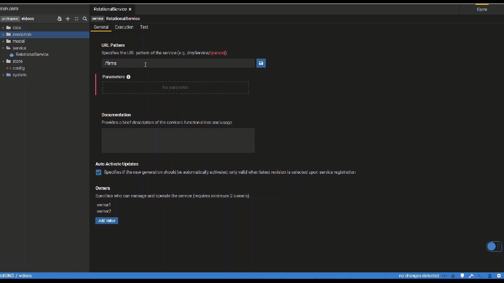

## Create a Service Test 
### Create connection test data
Click the `generate` button to automatically generate test data if possible. Otherwise, please manually create test data.
#### Relational
Add relational data tables based on databases to which the service's mapping connects. 
It's unnecessary to provide all columns with test data.
The columns used in the service, however, require test data. Besides, the primary keys have to be distinct.

#### External Format (M2M)
Click the `generate` button to automatically generate test data if possible. Otherwise, kindly manually provide test data for the source class's properties that serve as 
the foundation for the properties used in the service. e.g. As shown in the video, _Firm's name is used in the service, which comes from Firm's legalName. Therefore, manually providing test data for legalName will be sufficient if the `generate` button is not working.


#### Data element
More examples of different types of Data element creation could be found [here](#create-a-data-element).


#### Service Store


### Relational

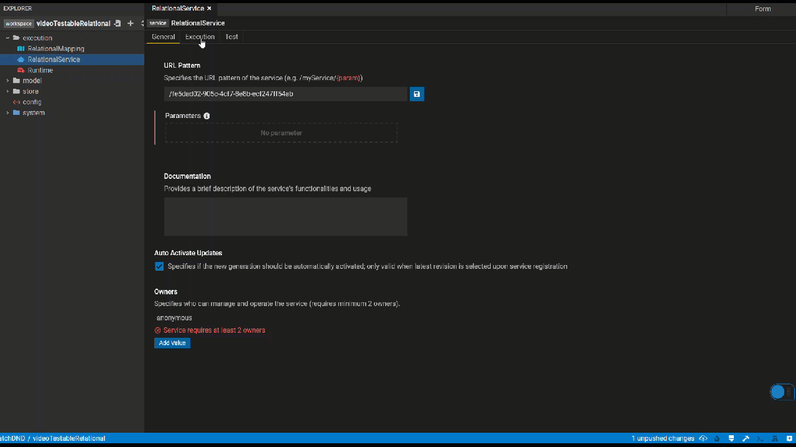

### Model to Model

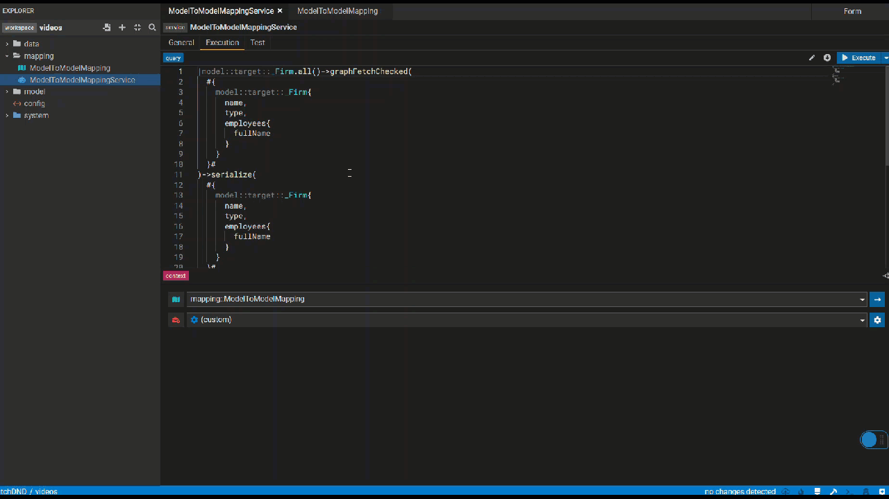

### Service Store

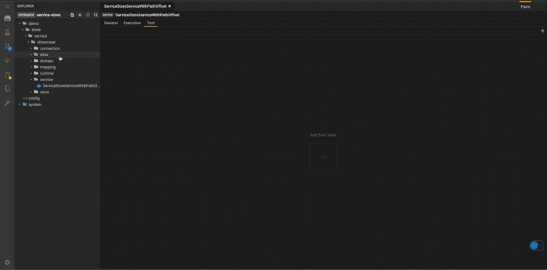

### With Data Element


### With Parameters
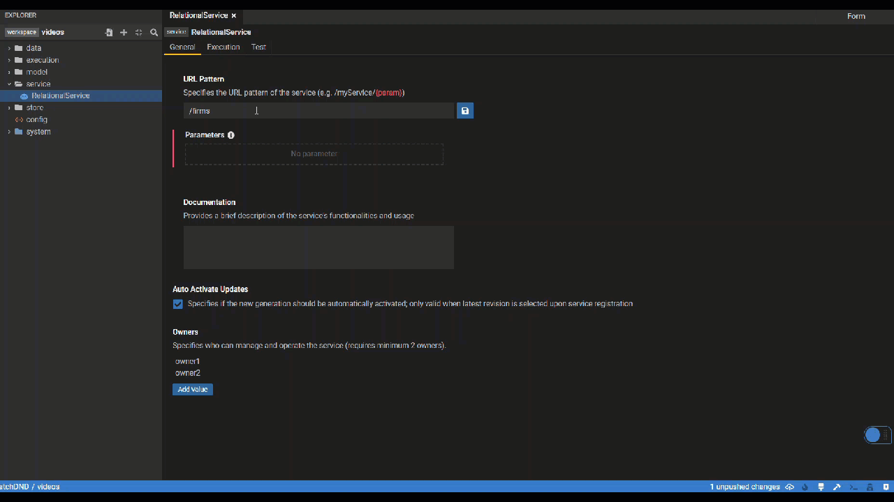


## Promote a model-to-model mapping query to a service

1. Create a model-to-model mapping (find instructions here) and select the **Promote to Service** icon.

2. Add a name for the service and hit create to launch the Service Editor.

## Promote a relational-to-model query to a service

This feature is not yet supported.

## Consume a Service

Consume data services via **executable service JAR files**. As part of the project build, an executable JAR file is generated for each service defined in the project. The executable service JAR file will be published in the Gitlab project that stores the data model code. The JAR file can be consumed by any Java application.

## Creating and Consuming a service execution JAR file

### Create and locate a JAR file

See below steps how to create and locate an executable JAR file for consumption in Studio.

1. Create a data service. Find instructions here.

2. Sync workspace.

3. Navigate to **Workflow Builds**.

4. Wait for the build to complete successfully.

5. Expand the generated workflow build to view the workflow details and click on **verify snapshot** to open the associated Gitlab pipeline.

6. In Gitlab, click on **Browse** under the Job artifacts.

7. Click on **artifacts**.

8. Locate the execution jar file and download it.

## Deploy JAR file

The executable JAR file can be used as a dependency to execute your service.

List the JAR file as a dependency in the Java application. For production use cases, the recommendation is to fetch the JAR file from a published repository (such as the public Maven repo).

## See features in action

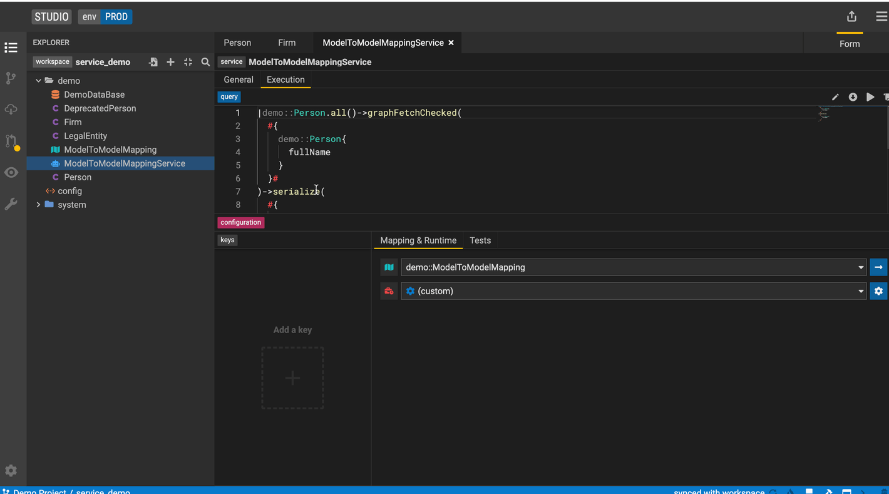

## Create a Flat Data Schema

1. Click the **+** on the left-hand side and select **New SchemaSet**.
2. Enter a name for the SchemaSet
3. Ensure the type (top left) is selected as **FlatData**
4. Click the **+** next to the type to add a schema. For FlatData only a single schema should be added to a SchemaSet.
5. For FlatData the **Id** and **Location** can be left blank
6. Define the format of the file by entering the [Flat Data Grammar](#flat-data-grammar)

   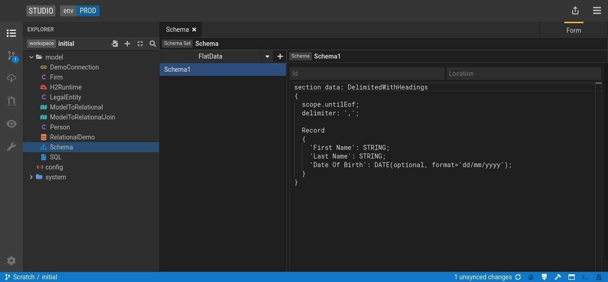

### Flat Data Grammar

#### Sections

Each file format is defined by a schema (a single entry in a Legend SchemaSet). Each schema consists of one or more sections. A section is defined in
grammar as:

```Legend
section section_name: driver_type
{
  properties
  record_definition
}
```

The `section_name` provides a name for the section and must be unique within a schema.

The `driver_type` defines the type of data contained in the section. See below for details of the core driver types available.

The `properties` are specific to the driver type and are detailed below. Each property is specified either as a name or as a name and value. Each
property specified is terminated by a semicolon (`;`). See example below.

A `record_definition` may be given for driver types that support one.

#### Record definitions

A record definition is specified as:

```Legend
Record
{
  record_fields
}
```

Where a `record_field` is:

```Legend
field_name: data_type(arguments)
```

or

```Legend
field_name {address}: data_type(arguments)
```

dependent on whether the driver type is self-describing (without address) or not (with address).

The `field_name` is the field's name. For self-describing drivers this will be the name of the field exactly as it appears in the file (for example the heading of the
column). If the `field_name` contains non-alphanumeric characters (other than underscores) it should be enclosed in single quotes (`''`). For drivers that
are not self-describing the `field_name` can be any name that is unique within a record type. The `address` then specifies how the field is identified
within the data. The `address` is thus driver specific, it is always given within braces (`{}`).

#### Data Types

The valid `data_types` are given below. All data types can take arguments; when none are used the parentheses (`()`) are omitted. Arguments consist of
the single word `optional` or are a specified as `argument=value`. Multiple arguments are comma (`,`) separated.

- [STRING](#string)
- [BOOLEAN](#boolean)
- [INTEGER](#integer)
- [DECIMAL](#decimal)
- [DATE](#date)
- [DATETIME](#datetime)

##### STRING

Allowable Options:

- `optional`

Examples:

- `STRING`
- `STRING(optional)`

##### BOOLEAN

Allowable Options:

- `optional`
- `trueString`
- `falseString`

Examples:

- `BOOLEAN`
- `BOOLEAN(optional, trueString='Yes')`
- `BOOLEAN(trueString='Y',falseString='N')`

Notes:

- If no `trueString` or `falseString` is specified then `true` (case insensitive) is taken to be true and any other value is considered false.
- If only a `trueString` is specified then its value (case insensitive) is taken to be true and any other value is considered false.
- If only a `falseString` is specified then its value (case insensitive) is taken to be false and any other value is considered true.
- If both a `trueString` and a `falseString` are specified their values (case insensitive) are taken to be true/false respectively and any other value is considered an error.
- The properties `defaultTrueString` and `defaultFalseString` can be used to specify behaviour for all BOOLEAN fields in a section.

##### INTEGER

Allowable Options:

- `optional`
- `format`

Examples

- `INTEGER`
- `INTEGER(optional, format='#,##0')`

Notes:

- Valid format strings are per Java's [DecimalFormat](https://docs.oracle.com/en/java/javase/11/docs/api/java.base/java/text/DecimalFormat.html) (as used for integer-only strings).
- The format for all `INTEGER` fields in a section can be specified using the defaultIntegerFormat property.

##### DECIMAL

Allowable Options:

- `optional`
- `format`

Examples

- `DECIMAL`
- `DECIMAL(optional, format='#,##0.0')`

Notes:

- Valid format strings are per Java's [DecimalFormat](https://docs.oracle.com/en/java/javase/11/docs/api/java.base/java/text/DecimalFormat.html) (as used for integer-only strings).
- The format for all `DECIMAL` fields in a section can be specified using the defaultDecimalFormat property.

##### DATE

Allowable Options:

- `optional`
- `format`

Examples

- `DATE`
- `DATE(optional, format='dd/MM/yyyy')`

Notes:

- Valid format strings are per Java's [DateTimeFormatter](https://docs.oracle.com/en/java/javase/11/docs/api/java.base/java/time/format/DateTimeFormatter.html) (as used for date-only strings).
- The format for all `DATE` fields in a section can be specified using the `defaultDateFormat` property.
- If a format is not specified, dates are expected to be in ISO 8601 format for dates only (`yyyy-MM-dd`).

##### DATETIME

Allowable Options:

- `optional`
- `format`
- `timeZone`

Examples

- `DATETIME`
- `DATETIME(optional, format='dd/MM/yyyy HH:mm')`
- `DATETIME(timeZone='EST')`

Notes:

- Valid format strings are per Java's [DateTimeFormatter](https://docs.oracle.com/en/java/javase/11/docs/api/java.base/java/time/format/DateTimeFormatter.html).
- The format for all `DATETIME` fields in a section can be specified using the `defaultDateTimeFormat` property.
- If a format is not specified, datetimes are expected to be in ISO 8601 format.
- If the datetime data does not include time zone information the time zone will be set according to the arguments/properties specified.
- Valid timeZone values are per Java's [ZoneId](https://docs.oracle.com/en/java/javase/11/docs/api/java.base/java/time/ZoneId.html) including [SHORT_IDS](https://docs.oracle.com/en/java/javase/11/docs/api/java.base/java/time/ZoneId.html#SHORT_IDS).
- The default time zone for all `DATETIME` fields in a section can be specified using the `defaultTimeZone` property.
- When no time zone information is specified it is assumes to be UTC.

#### Driver: DelimitedWithHeadings

This driver reads data rows in which columns of data are separated by a delimiter. The first row specifies the headings for each column and hence defines
the order of data. A classic CSV file is an example of this.

##### Properties

- [Common Streaming Properties](#common-streaming-properties).
- [Common Delimited Properties](#common-delimited-properties).
- [Common Data Properties](#common-data-properties).
- `modelledColumnsMustBePresent` optional property which can be added as an option to assert that all fields specified in the Record must be present
  in the column headings row regardless of whether the field is optional.
- `onlyModelledColumnsAllowed` optional property which can be added as an option to prohibit any fields not specified in the Record from being
  present in the column headings row.

##### Record

A `Record` definition is expected for this driver and its fields must not specify address values.

#### Driver: DelimitedWithoutHeadings

This driver reads data rows in which columns of data are separated by a delimiter and where no headings row is present.

##### Properties

- [Common Streaming Properties](#common-streaming-properties).
- [Common Delimited Properties](#common-delimited-properties).
- [Common Data Properties](#common-data-properties).

##### Record

A `Record` definition is expected for this driver and its fields must specify address values.
The addresses are the one-based column positions of the data within the file.

#### Driver: ImmaterialLines

This driver is used to skip unnecessary lines of data.

##### Properties

- [Common Streaming Properties](#common-streaming-properties).

##### Record

A `Record` definition must not be specified.

#### Common Delimited Properties

- `delimiter` mandatory property which specifies the column separator character(s).

- `quoteChar` optional property which defines the character used for quoting strings within the file rows so that they can include delimiters and/or ends-of-lines.

  When quoting is used a quote character within a quoted string can be escaped by repeating it (for example the text 'It''s OK', where `quoteChar: '\'';` has been specified, equates to the value It's OK).

- `escapingChar` optional property which defines the character used to escape other characters.
  Escaping can be used both within and outside quoted text.

  Inside a quoted string the above example could have been `'It\'s OK'`, where `quoteChar: \'';` and `escapingChar: '\\'`; have been specified, also equates to the value It's OK.

  Outside it can be used to escape delimiters such that the text `Hello\, World, Goodbye`, where `delimiter: ',';` and `escapingChar: '\\';` have been specified, equates to two column values of `Hello, World` and `Goodbye`.

- `nullString` - optional property defining the text which equates to a null (missing) value.
  When this property is not specified the value is considered to be always present thus two delimiters in succession is interpreted as an empty string.
  To treat that as a null value you need to specify `nullString: '';`.

  Multiple `nullString` properties can be used to specify more that one value.

#### Common Streaming Properties

- `recordSeparator` optional property that defines the character(s) used to separate records within the file.
  This is commonly the end-of-line character(s).

  If this option is not specified the file will be separated using any of the commonly used line endings (`\n`, `\r\n` and `\r`);
  **this is usually the best option to alleviate issues with data being copied between different computers with different operating systems.**

- `mayContainBlankLines` optional property which can be added as an option to specify that blank lines within the file should be ignored.

- `scope` required property that specifies the scope of the section.
  Options are:
  - `scope.default;` use this unless you want a specific alternative
  - `scope.forNumberOfLines = n;` if the section spans an exact number of lines
  - `scope.untilLineEquals = 'END';` if the section spans until a marker line of the specified text
  - `scope.untilEof;` if the section spans for the remainder of the data

#### Common Data Properties

- `defaultIntegerFormat`
- `defaultDecimalFormat`
- `defaultTrueString`
- `defaultFalseString`
- `defaultDateFormat`
- `defaultDateTimeFormat`
- `defaultTimeZone`

See [Data Types](#data-types) for usage.

#### Examples

This example defines a CSV file with:

- an ignored header row
- a column headings row
- data rows

```Legend
section header: ImmaterialLines
{
  scope.forNumberOfLines: 1;
}

section data: DelimitedWithHeadings
{
  scope.default;
  delimiter: ',';
  modelledColumnsMustBePresent;
  onlyModelledColumnsAllowed;

  Record
  {
    'First Name': STRING;
    'Last Name': STRING;
    Age: INTEGER(optional);
  }
}
```

This example defines a pipe-delimited file without headers.
Columns are therefore addressed positionally:

```Legend
section data: DelimitedWithoutHeadings
{
  scope.default;
  delimiter: '|';

  Record
  {
    FirstName {1}: STRING;
    LastName {2}: STRING;
    Age {3}: INTEGER(optional);
  }
}
```

## Review and Commit Changes

Legend is integrated with the software development lifecycle (SDLC) supported by GitLab, which lets you review and commit changes.

Follow these steps to review and commit a change.

1. Press `Ctrl+S` to sync the local changes to the workspace.

   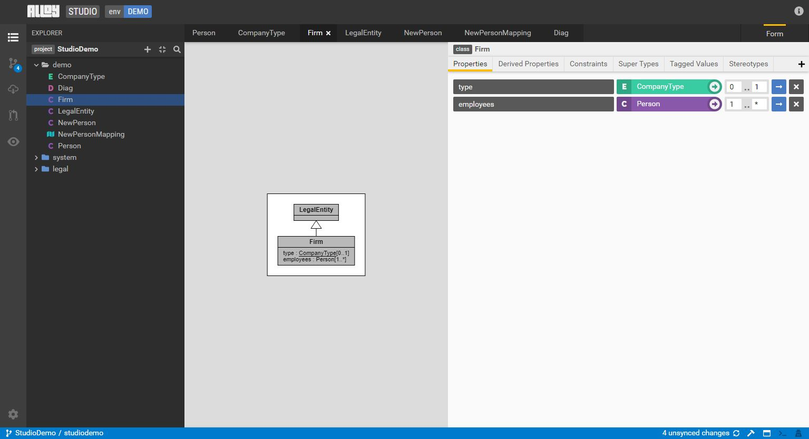

2. Select the diff view to review the synced changes in workspace.

   

3. To create a review, click the highlighted icon in the activity bar or press `Ctrl + Shift + M` to go to the review panel. Here you can review the code in the current workspace vs. the committed code.

   

4. After the review is approved, click **Commit**.

   

## Update workspace with latest changes

When the workspace is out of date, Studio provides a notification in the status bar on the bottom left. Click the update button on the sidebar to bring in the latest changes.

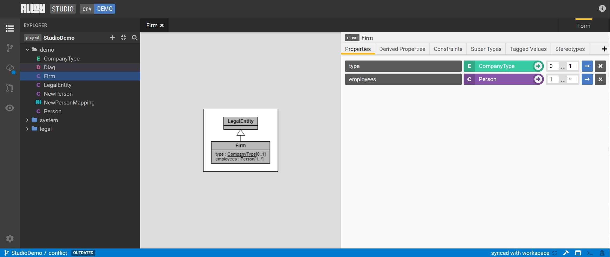

## Resolve a conflict in the workspace

A workspace update may result in a conflict. Studio will open a new view to aid in resolving the conflict.

1. Choose one of the following actions:

   - **Discard the changes**: the workspace changes are removed.

   - **Review the changes**: the workspace changes will be applied on top of the latest version.

   

2. If you chooose to review changes, review and press `F9` to compile.

3. Once the changes compile successfully, either accept or discard the changes.

   

## Define project dependencies

When you add a dependency, all its dependencies are included as well. For example, if model $A$ creates a dependency on "Listed Product", and "Listed Product" depends upon the "Foundation" model, you _do not_ need to add a separate dependency to Foundation for model $A$ to depend on it. The dependency is already included in your dependency to other projects.

### Dependency version control

_COMING SOON_

### Frequently Asked questions

_COMING SOON_

## File Generation

File generation lets you generate your models in other codes or schemas.

### Creating a File Generation

_COMING SOON_
