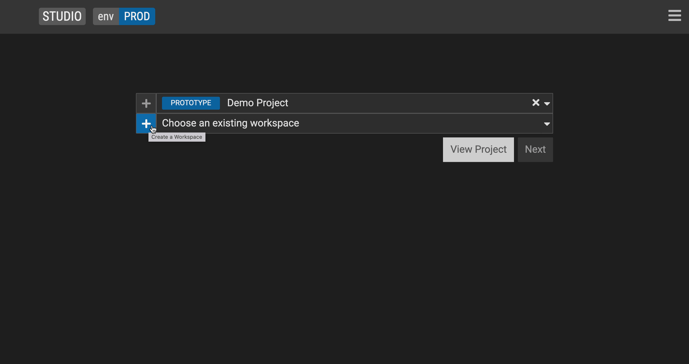

## Workspace

Start working on your data model by creating a [workspace](../overview/legend-features.md/#workspace). A workspace is a copy of a project which can be later merged back into the main project. It represents a branch in the underlying GitLab project. To create a workspace:

1. Select an existing (GitLab) project or select <kbd>+</kbd> to start working on a new one. Please note that the FINOS hosted version of [Legend Studio](https://legend.finos.org/studio/-/setup) does **not** support creating a new project at this time.

2. Create a workspace.

3. Click <kbd>Next</kbd>.

## Group workspace

To create a [group workspace](../overview/legend-features.md/#group-workspace):

1. Follow steps above to create a workspace

2. Check the <kbd>Group workspace</kbd> check box.

## Text Mode

   

To access or exit [Text mode](../overview/legend-features.md/#text-mode): Press `F8` or the hacker icon on the bottom right corner of your scrreen. The bar should change when you open or close Text mode.

To compile your code: Press `F9`

## More
- [Showcase projects](../showcases/showcase-projects.md)
- [Legend Features](../overview/legend-features.md)
- [Legend Glossary](../overview/legend-glossary.md)
- [Reference documentation](../reference/legend-language.md)
- [Studio tutorials](../tutorials/studio-create-model.md)
- [Query tutorials](../tutorials/query-builder.md)

